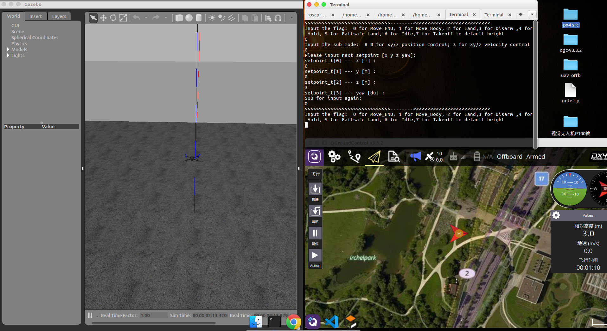
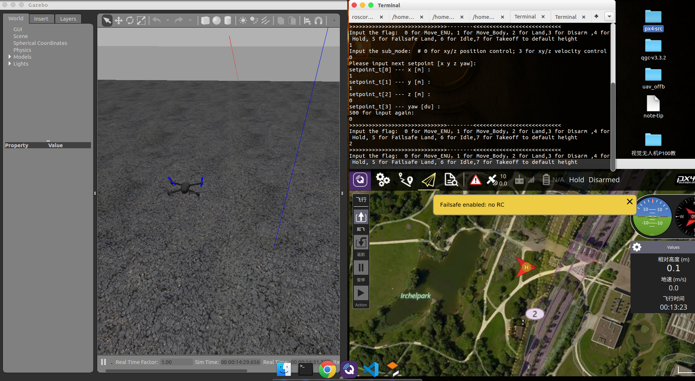
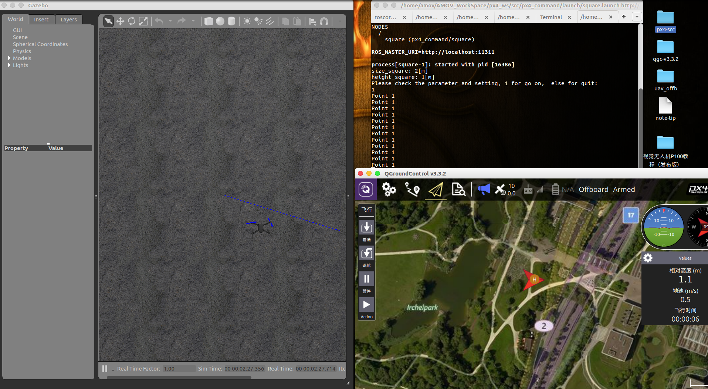
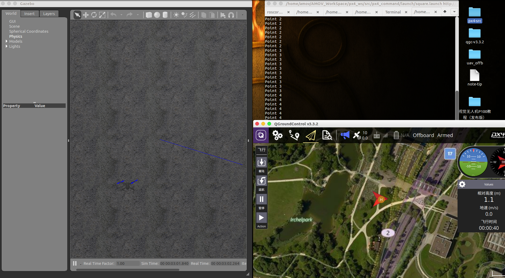
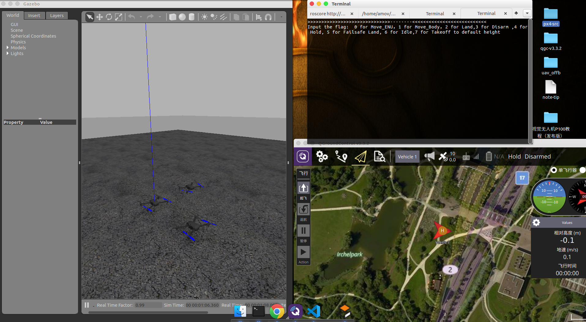

.. Gazebo仿真:

===============
Gazebo仿真
===============

PX4提供了一种全自主飞行控制方式，offboard模式。而阿木社区具有
一套完整，可靠的系统体系。阿木社区的学员们在购买我们的飞机回去
之后发现对我们的系统体系还不是了解，导致操作不当还是会有很多
炸机现象，为了让学员们更加了解系统体系的种种情况，现推出仿真环境平台,
对阿木系统体系的仿真模拟。有了这一套仿真系统，可以在不用实际飞行情况下理解阿木系统体系中的逻辑，
减少实际飞行中炸机的发生。 本篇文章中，会讲解如何使用系统体系控制无人机飞行。本套仿真平台在
Ubuntu16.04（16.04.6）LTS，ROS-Kinetic（1.12.14），
Firmware（1.8.2），QGroundControl-v3.3.2，交叉编译
工具链为gcc-arm-none-eabi-5_4-2016q2，mavros以及
mavlink的二进制安装下，测试通过。先从搭建环境开始讲起吧。

第一节 硬件准备
================

本套仿真环境既可以在Windows下面的VMware下面搭建,也可以在实体机上面搭建.Windows虚拟机VMware下面我们提供搭建好了的开发环境,
包括PX4开发环境,mavros环境,ROS环境.但是,需要注意,虚拟机上运行会很卡,如果有显卡的话,打开3D加速,不是很卡顿.

本篇文章是在实体机上搭建环境的,电脑配置如下:显卡NVIDIA GTX2060;CPU为AMD Ryzen 5 3600 6-Core Processor × 12,内存大小为16G,256固态硬盘

第二节 软件配置
================

1.Ubuntu16.04操作系统
-----------------------

用UltraISO制作U盘启动盘，步骤如下:

-   打开UltraISO软件，打开文件，选择要安装的Ubuntu版本，
    安装的镜像是Ubuntu-16.04.6，偶数版本表示长期(5年)维护的系
    统镜像，在2021年之前是支持的。
-   接着我们点击启动->写入磁盘映像，进入下面的界面，在制作
    Ubuntu的U盘启动盘的时候，要选择RAW。之前也尝试过其他
    的写入方式，偶尔会成功，偶尔会失败。但选择RAW之后，装的好几次都是成功了的，所以建议用RAW写入方式。   
-   之后就是把U盘格式化，然后点击写入即可，
    等待......（长短取决于电脑性能），待完成之后U盘启动盘就
    制作成功了。

安装Ubuntu系统

    插上U盘，开机启动选项中设置U盘启动即可，一般不同的电脑进
    入BIOS的方式不同。之后的安装很简单，百度上有很多教程，
    按照教程安装即可完成安装。本次安装是一块新的256固态硬盘,全盘直接安装的是Ubuntu系统，
    所以没有什么分区设置。

Ubuntu系统的技巧设置

-   技巧一 刚装完Ubuntu后发现分辨率很低，屏幕看起来很别扭。查看了一下，
    分辨率只有640x480，然而我的屏幕是1920x1080的。然后通过改
    xrandr和cvt都无效。经过一番查找,找到解决方案，修改grub默认的
    分辨率，具体过程如下： sudo gedit /etc/default/grub 
    找到: #GRUB_GDXMODE=640x480 改为: 
    GRUB_GDXMODE=1920x1080 然后更新一下grub: 
    sudo update-grub 最后重启电脑即可
-   技巧二 建议在安装完系统之后，只留下现在所使用的版本的内核，
    删除其余多余的内核，并且禁用内核的更新，否则过段时间，
    系统默认启动更新后的内核。(具体的如何禁用设置上网一搜索便可找到)
-   安装显卡驱动，Ubuntu默认的显卡驱动是nouveau，你需要安装
    与你显卡相匹配的驱动程序。以NVIDIA驱动为例，首先是查看自己
    显卡，发现是设备ID为1f08，通过 `NVIDIA驱动ID查看 <https://devicehunt.com/view/type/pci/vendor/10DE/device/1F08>`_
    搜索发现该驱动是GTX2060，然后我们到 `NVIDIA驱动程序下载 <https://www.nvidia.com/Download/index.aspx?lang=cn>`_ 下载相应的驱动
    下载相应的驱动安装程序。安装的过程你可以参考这篇文档 `NVIDIA驱动安装 <https://zhuanlan.zhihu.com/p/31575356>`_ 

::

    如下命令就是查看自己电脑当前可用的显卡,获取到NVIDIA显卡的设备ID
    amov@amov:~$ lspci | grep VGA
    0a:00.0 VGA compatible controller: NVIDIA Corporation Device 1f08 (rev a1)

2.PX4环境安装
---------------

参考官方文档 `Ubuntu下px4开发环境搭建 <https://dev.px4.io/master/en/setup/dev_env_linux_ubuntu.html>`_  .
该文档链接是在当时环境下的master文档,对应的是1.8.2的wiki文档

在安装完Ubuntu系统的第一件事情就是用户组的添加

::

    sudo usermod -a -G dialout $USER

然后按照官网教程，在~/下新建一个文件，重命名为ubuntu_sim.sh。在官网打开ubuntu_sim.sh脚本，
全部复制拷贝到新建的脚本中，接着给脚本可执行权限。最后执行这个脚本。

::

    sudo gedit ubuntu_sim.sh
    chmod +x ubuntu_sim.sh
    sudo ./ubuntu_sim.sh

这个安装的快慢与你的网速有关。这个脚本本身是没有安装交叉编译工具链的。交叉编译工具链需要手动安装，
接下来是手动安装交叉编译工具链： `交叉编译工具镜像下载 <https://bigsearcher.com/mirrors/gcc/releases/>`_ 
下载你所需要的gcc版本。 下载之后解压并放到/opt/之下，下图所示本机的gcc的路径

::

    amov@amov:/opt/gcc-arm-none-eabi-5_4-2016q2/bin$ pwd
    /opt/gcc-arm-none-eabi-5_4-2016q2/bin

然后打开/etc/profile文件，如下

::

    amov@amov:/opt/gcc-arm-none-eabi-5_4-2016q2/bin$ sudo gedit /etc/profile

在最下面添加一行

::

    export PATH=$PATH:/opt/gcc-arm-none-eabi-5_4-2016q2/bin

路径就是gcc存放的路径。接着source一下刚才修改的/etc/profile

::

    source /etc/profile

测试安装gcc是否成功，输入

::

    arm-none-eabi-gcc --version

若出现如下类似，说明安装成功

::

    amov@amov:~$ arm-none-eabi-gcc --version
    arm-none-eabi-gcc (GNU Tools for ARM Embedded Processors) 5.4.1 20160609 (release) [ARM/embedded-5-branch revision 237715]
    Copyright (C) 2015 Free Software Foundation, Inc.
    This is free software; see the source for copying conditions.  There is NO
    warranty; not even for MERCHANTABILITY or FITNESS FOR A PARTICULAR PURPOSE.

若输出是：

::

    arm-none-eabi-gcc --version
    arm-none-eabi-gcc: No such file or directory

需要安装32位支持库 `此链接查看详细步骤 <https://px4.osdrone.net/1_Getting-Started/adcanced_linux.html>`_

::

    sudo apt-get install libc6:i386 libgcc1:i386 libstdc++5:i386 libstdc++6:i386

现在PX4环境配置已经完成，之前在运行ubuntu_sim.sh脚本中下载过Firmware，建议重新下载一个PX4固件。

::

    amov@amov:~/Desktop/px4-src/src-1.8.2$ ls
    amov@amov:~/Desktop/px4-src/src-1.8.2$ git clone https://github.com/PX4/Firmware.git
    Cloning into 'Firmware'...
    remote: Enumerating objects: 278734, done.

下载完之后，我们进入到Firmware中，下载的还需要更新子模块

::

    amov@amov:~/Desktop/px4-src/src-1.8.2$ cd Firmware/
    amov@amov:~/Desktop/px4-src/src-1.8.2/Firmware$ git checkout v1.8.2
    amov@amov:~/Desktop/px4-src/src-1.8.2/Firmware$ git submodule update --init --recursive

漫长等待之后，就可以编译源码了，先试试最基本的能力。 首先是编译源代码

::

    amov@amov:~/Desktop/px4-src/src-1.8.2/Firmware$ make px4fmu-v5_default

若编译成功的话，再执行编译最基本的gazebo仿真

::

    amov@amov:~/Desktop/px4-src/src-1.8.2/Firmware$ make px4_sitl_default gazebo

到此为止，说明你的PX4环境配置已经搭建完成了。下来我们会配置与Ubuntu16.04系统对应的ROS Kinetic版本。

.. tip::

    在px4固件代码v1.8.2之前的编译规则和v1.8.2之后的编译规则略有不同,

    v1.8.2中编译v5固件命令为 make px4fmu-v5_default.v1.9.2中编译v5固件命令为 make px4_fmu-v5_default

    v1.8.2中编译gazebo仿真命令为 make posix_sitl_default gazebo . v1.9.2中编译gazebo仿真命令为 make px4_sitl_default gazebo

3.ROS-Kinetic安装
-------------------

ROS-Kinetic的安装参考 `ROS-Kinetic官网安装教程 <http://wiki.ros.org/kinetic/Installation/Ubuntu>`_ 需要注意的一点是，
在安装ROS时候，国内最好选择镜像来自中科大的源或者是清华的源，其他就是按照官网提示一步步安装即可。

.. tip::

    安装ROS（有700MB到800MB）完成之后，查看是否安装成功，如下表示安装ROS完成。

::

    amov@amov:~$ roscore
    ... logging to /home/amov/.ros/log/d98e04fe-b1ca-11e9-bf5f-e0d55ee7d1ba/roslaunch-amov-23391.log
    Checking log directory for disk usage. This may take awhile.
    Press Ctrl-C to interrupt
    Done checking log file disk usage. Usage is <1GB.

    started roslaunch server http://amov:39279/
    ros_comm version 1.12.14

    SUMMARY
    ========

    PARAMETERS
    * /rosdistro: kinetic
    * /rosversion: 1.12.14

    NODES

    auto-starting new master
    process[master]: started with pid [23401]
    ROS_MASTER_URI=http://amov:11311/

    setting /run_id to d98e04fe-b1ca-11e9-bf5f-e0d55ee7d1ba
    process[rosout-1]: started with pid [23414]
    started core service [/rosout]

4.mavlink与mavros安装
-----------------------

mavlink与mavros的安装参考 `mavros官方安装 <https://github.com/mavlink/mavros/blob/master/mavros/README.md#installation>`_

最好最清晰的安装过程便是官方提供的步骤,以安装二进制源码的方式安装mavros,切记按照提示一步一步完成,

5、下载QGroundControl
-----------------------

本系统的qgc版本是v3.3.2，是通过Qt5.11.0编译生成的。建议直接下载可执行程序，可参考开发者手册
`QGC下载与安装 <https://docs.qgroundcontrol.com/en/getting_started/download_and_install.html>`_

第三节 仿真过程
================

上节中，我们已经搭建好PX4仿真的环境了，而本节旨在下载阿木社区的源码，并且建立新的工作空间到
个人工作路径下，然后配置仿真所使用的固件版本的选择以及环境配置，最后进行仿真操作。先从如何
下载阿木社区源码说起

1.打开阿木社区的GitHub
-----------------------

上网进入 `amovlab <https://github.com/amov-lab>`_ 阿木实验室维护的GitHub.

2.下载源码并建立工作区间
------------------------

详细的建立工作空间请查看阿木社区GitHub上的项目 px4_commander.
或者如下链接：`px4_command <https://github.com/amov-lab/px4_command>`_

建立好工作空间之后，笔者的工作空间如下：

::

    amov@amov:~/AMOV_WorkSpace$ cd px4_ws/
    amov@amov:~/AMOV_WorkSpace/px4_ws$ ls
    build  devel  src
    amov@amov:~/AMOV_WorkSpace/px4_ws$ cd devel/
    amov@amov:~/AMOV_WorkSpace/px4_ws/devel$ ls
    cmake.lock  lib               local_setup.zsh  _setup_util.py
    env.sh      local_setup.bash  setup.bash       setup.zsh
    include     local_setup.sh    setup.sh         share
    amov@amov:~/AMOV_WorkSpace/px4_ws/devel$

打开.bashrc 文件

::

    amov@amov:~/AMOV_WorkSpace/px4_ws/devel$ sudo gedit ~/.bashrc

需要在.bashrc 文件最后添加一行如下：

::

    source ~/AMOV_WorkSpace/px4_ws/devel/setup.bash

3.添加环境变量 .bashrc 文件添加如下
-----------------------------------

::

    source ~/Desktop/px4-src/src-1.8.2/Firmware/Tools/setup_gazebo.bash ~/Desktop/px4-src/src-1.8.2/Firmware/ ~/Desktop/px4-src/src-1.8.2/Firmware/build/px4_sitl_default
    export ROS_PACKAGE_PATH=$ROS_PACKAGE_PATH:~/Desktop/px4-src/src-1.8.2/Firmware
    export ROS_PACKAGE_PATH=$ROS_PACKAGE_PATH:~/Desktop/px4-src/src-1.8.2/Firmware/Tools/sitl_gazebo

4.启动仿真
------------

进入工作区间仿真部分目录下，可以看到有6个脚本文件

::

    amov@amov:~/AMOV_WorkSpace/px4_ws/src/px4_command/sh/sh_for_simulation$ ls
    sitl_gazebo_formation.sh       sitl_gazebo_square.sh
    sitl_gazebo_iris.sh            sitl_jMAVSim_pos_controller.sh
    sitl_gazebo_pos_controller.sh  sitl_test.sh

启动sitl_gazebo_iris.sh脚本,执行如下

::

    amov@amov:~/AMOV_WorkSpace/px4_ws/src/px4_command/sh/sh_for_simulation$ ./sitl_gazebo_iris.sh

即可进入仿真界面。

第四节 仿真脚本说明
===================

1.脚本sitl_gazebo_iris.sh
---------------------------

正常启动sitl_gazebo_iris.sh腳本，基本操作流程和实体飞机操作流程一致。 先起飞3m,如下图:

接着,我们在Move_Body坐标系下,x,y,z分别为1,1,0.飞行轨迹如下图:

最后我们执行一下land模式,如下图:

存在Bug描述：

-   若起飞之后飞机降落至地面，无法进行再次起飞。（和实体飞机一致现象）
-   在ENU坐标系下，若使用速度控制，进行起飞2M，飞机一致向上飞，不会停止，在gazebo中，飞至26M，切换至悬停模式，无法成功相应，飞至30M，切换至land，正常降落。
-   经过多次测试，move节点中，按键4hold模式无响应，在两种坐标系下的速度控制中，飞机一直向上飞。
-   在passivity控制率下，正常设置起飞3M，飞机纯粹油门量最大向上直飞，到达53M左右之后，有姿态角的迅速降落，直至炸机。
-   在NE控制率下，正常设置起飞3M，飞机纯粹油门量最大向上直飞，一直飞。

2.脚本sitl_gazebo_square.sh
------------------------------

.. note::

    直接下载的px4_command是没有sitl_gazebo_square.sh该脚本的,需要手动添加该脚本.首先可以建立一个新的可执行脚本sitl_gazebo_square.sh,添加下面内容:

    |   gnome-terminal --window -e 'bash -c "roscore; exec bash"' \
    |   --tab -e 'bash -c "sleep 4; roslaunch px4 posix_sitl.launch; exec bash"' \
    |   --tab -e 'bash -c "sleep 2; roslaunch mavros px4.launch fcu_url:="udp://:14540@127.0.0.1:14557"; exec bash"' \
    |   --tab -e 'bash -c "sleep 2; roslaunch px4_command px4_pos_controller.launch; exec bash"' \
    |   --tab -e 'bash -c "sleep 2; rosrun px4_command set_mode; exec bash"' \
    |   --tab -e 'bash -c "sleep 2; roslaunch px4_command square.launch; exec bash"' \

正常启动sitl_gazebo_square.sh脚本。确定并初始化px4_pos_controller节点。然后在set_mode节点中切换至offboard模式。检查square节点中，
按键１执行飞正方形。最后在qgc中解锁飞机，飞机正常按照Point点进行飞行。

在飞机飞正方形的时候,有5个point点的设置,飞行过程部分截图如下
point1: 

point2: 

point4: 

point5: 

3.脚本sitl_gazebo_formation.sh
---------------------------------

下载下来的px4_command也可能不能直接进行多机仿真,在自己本机下面的固件代码中的launch文件需要改一下名称,可能没有three_uav_mavros_sitl.launch.
需要将现有的multi_uav_mavros_sitl.launch改为three_uav_mavros_sitl.launch . 运行仿真之后可能只出现两架飞机,原因是,在px4_command中的多机仿真用的是uav0,uav1,uav2,
而在你下载的固件代码中只有uav1,uav2.没有uav0,这时候你需要手动添加一个uav0出来,才能多机(3架飞机)仿真跑起来.

正常启动sitl_gazebo_formation.sh，在启动正常的情况下（qgc可以连接上三个飞机），此时确认formation_control节点并初始化，
按照ENU坐标系下，设置坐标点，三架飞机同步执行动作。如下图: 

存在Bug描述： 

-   启动脚本失败（已将时间由２改为４，成功启动概率增大）
-   确认初始化formation_control节点之后，打印信息有问题。UAV2显示未连接，解锁状态无响应，飞行模式无显示 
-   飞机解锁之后，设置好第一个坐标点，飞机起飞，相互位置会有所调换，然后悬停至稳定
-   使用land模式之后，有的飞机会直接失控，有的会缓缓降落。
-   飞机执行land落地之后飞行模式在pos与RTL之间频繁切换

