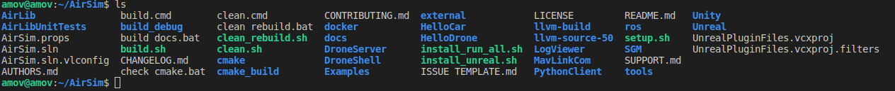
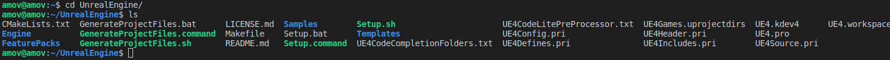
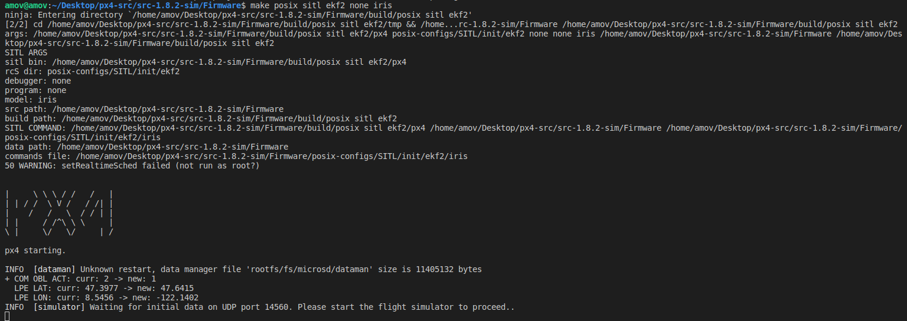
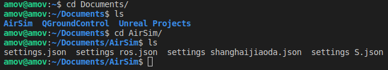
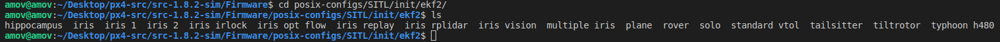
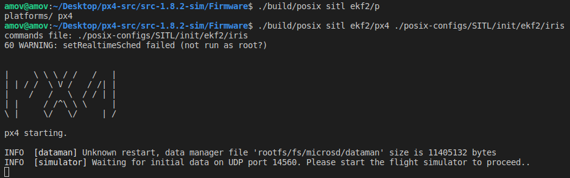
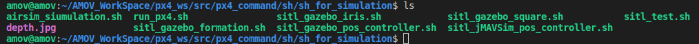

.. AirSim

=======
AirSim
=======

第一节 AirSim介绍
======================

AirSim是一款为飞行器,汽车,甚至更多的一种仿真器,而UE4则是为这款
仿真器提供完整的环境,比如森林,道路等.它是一款开源的,跨平台的,
且支持现有的px4飞行控制器硬件在环仿真,提供了物理和视觉逼真的模拟.
它是作为UE4插件开发的,先从仿真环境搭建开始.

第二节 基于Ubuntu16.04下的环境搭建
====================================

1 AirSim环境
--------------

a AirSim环境github安装
^^^^^^^^^^^^^^^^^^^^^^^^^

::

    git clone https://github.com/microsoft/AirSim.git
    cd AirSim
    ./setup.sh
    ./build.sh

下载好git库之后,可以看到里面有setup和build脚本.安装完成即可.

b UE4环境
^^^^^^^^^^^

.. tip::

    注意要去epic game 官网绑定你的 epic game账号和github账号,一定要在留的邮箱中点击确认,如果没有收到邮件,则去github UE4首页手动确认

-   具体绑定方法可以去 `UE4与github教程 <https://www.unrealengine.com/en-US/ue4-on-github>`_
-   网络环境一定要好,不然可能下载不下来

::

    git clone -b v4.18 https://github.com/epicGames/UnrealEngine.git

-   这里输入的是github的用户名而不是账号

::

    cd UnrealEngine
    ./Setup.sh
    ./GenerateProjectFiles.sh
    make

同样的,下载好git库之后,可以看见Setup和GenerateProjectFiles这两个可执行脚本,依次运行即可.

2 PX4环境
-----------

px4的环境在之前有讲过,安装的顺序也是先安装完成了gazebo那篇的仿真环境搭建,之后才开始安装airsim.

在完成px4环境之后,进入px4原生固件准备编译,本机下的路径:

.. image:: ../images/Airsim_build_Firmware_path.png

::

    make posix_sitl_ekf2 none_iris

编译完成最后出现如下图,等待UDP连接

.. note::

    之前已经编译过,所以这次编译会直接出现结果,没有编译过程

3 mavros安装
--------------

mavros的安装之前在gazebo仿真搭建文章也都有讲过,如果是第一次直接安装airsim仿真环境,则需要看看之前的gazebo仿真环境搭建过程;如果您已经完成了gazebo仿真环境的搭建,那么该步骤可以忽略.

第三节 使用说明
=================

**在使用之前,关闭所有与airsim,UE4,px4有关的窗口**

1 修改json文件(在document/AirSim文件夹中)
------------------------------------------

修改为如下即可

::

    {
        "SeeDocsAt": "https://github.com/Microsoft/AirSim/blob/master/docs/settings.md",
        "SettingsVersion": 1.2,
        "SimMode":"Multirotor",
        "Vehicles":{
                "PX4":{
             	        "VehicleType":"PX4Multirotor",
                        "UseSerial":false
            }
        }
    }

2 SITL连接UE4,QGC
--------------------

a 进入到PX4/Firmware目录下,编译
^^^^^^^^^^^^^^^^^^^^^^^^^^^^^^^^^^

::

    make posix_sitl_ekf2 none_iris

修改配置文件PX4/posix-config/SITL/init/ekf2/iris

编译iris文件,添加以下几点:

-   设置GPS原点与AirSim中一致

::

    param set LPE_LAT 47.641468
    param set LPE_LON -122.140165

-   在offboard模式下执行完指令后自动悬停

::

    param set COM_OBL_ACT 1

-   在仿真下需要添加下面参数,但在实机飞行中,需要禁用掉

::

    param set NAV_RCL_ACT 0
    param set NAV_DLL_ACT 0

接下来是打开SITL,进入到PX4/Firmware目录下,如下图

::

    ./build/posix_sitl_ekf2/px4 ./posix-configs/SITL/init/ekf2/iris

-   编译完成之后,等待UDP连接
-   打开QGC
-   打开UE4Editor
-   查看PX4状态

b 控制飞行
^^^^^^^^^^^^

进入px4_command/sh/sh_for_simulation目录下

自己新建一个airsim_simulation.sh脚本,添加如下启动文件

::

    ##sitl_airsim
    gnome-terminal --window -e 'bash -c "roscore; exec bash"' \
    --tab -e 'bash -c "sleep 2; roslaunch mavros px4.launch fcu_url:="udp://:14540@127.0.0.1:14557"; exec bash"' \
    --tab -e 'bash -c "sleep 2; roslaunch px4_command px4_pos_controller.launch; exec bash"' \
    --tab -e 'bash -c "sleep 5; rosrun px4_command move; exec bash"' \
    --tab -e 'bash -c "sleep 2; rosrun px4_command set_mode; exec bash"' \

在该目录下,启动该脚本即可

::

    ./airsim_simulation.sh

之后的飞行操作和gazebo下的操作是一样的.