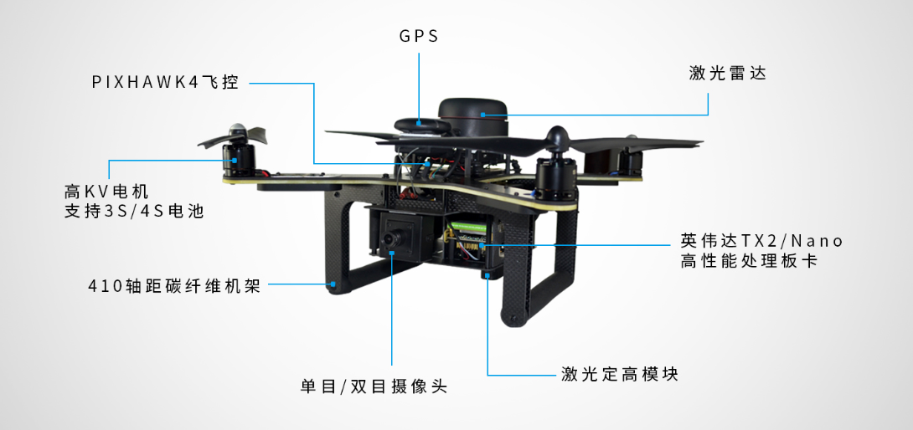
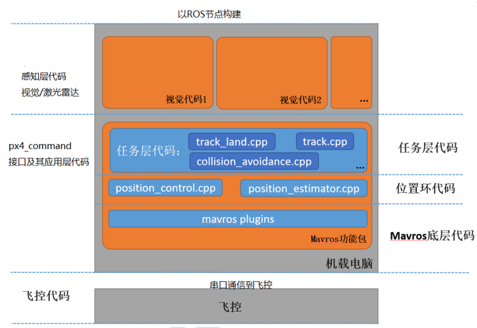
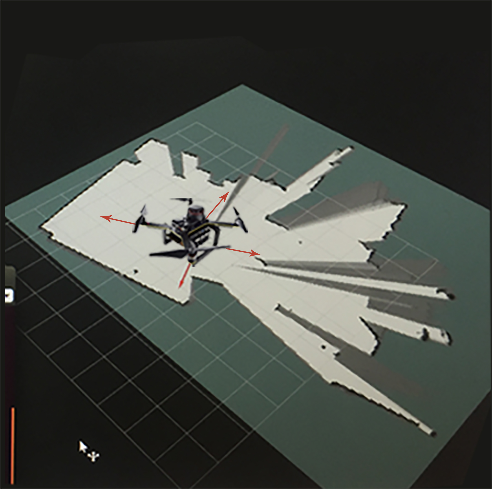
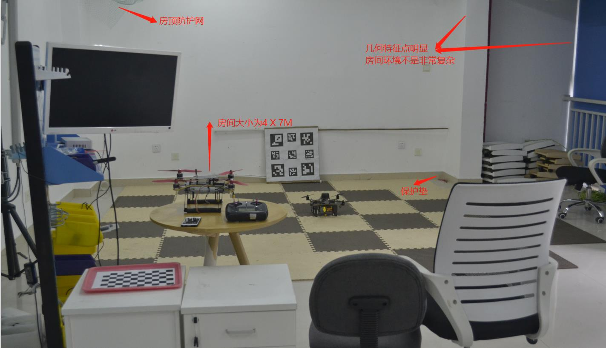
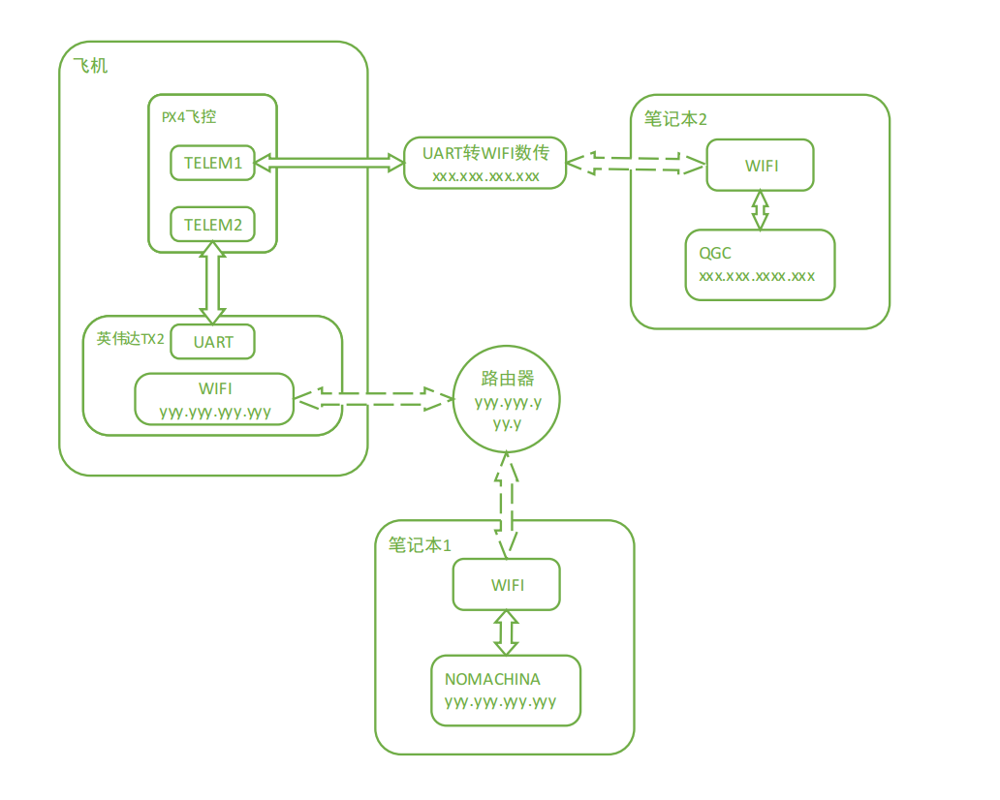

.. px4_command&P200使用说明

==========================
px4_command&P200使用说明
==========================

第一节 基础知识储备
==================

1 C/C++ / Python
-------------------

2 PX4飞控的简单调试
-------------------

3 Ubuntu系统的使用
-------------------

4 ROS,MAVROS
----------------

5 Git的使用
-------------

.. image:: ../images/git.png

第二节 PX00飞机介绍
===================

1 概述
-------

该科研无人机采用PX4软硬件体系架构,板载计算机为TX2或Nano,配合外部传感器(激光雷达,摄像头),仿真系统采用gazebo或airsim+UE4

2 硬件
-------

硬件框架

.. image:: ../images/PX00_hardware_framework.png

3 软件
-------

总体软件框架

第三节 飞行准备
===================

1 室内飞行
----------

a 环境要求
^^^^^^^^^^^

室内我们采用的激光雷达进行定位，因为采用的二维雷达，会在室内构建出如下的平面地图

所以在测试以前要选择一个房间大小合适(A1/A2雷达半径12米有效，A3雷达半径25米有效)，房间不能地形非常复杂，也不能没有角点和几何特征点，否则不能很好的构建出地图，就不能很好的定位。

我们的测试环境如下：

房间内有一些防护装置，房顶的防护网，地面的保护垫等等最好具备，防止伤人和损坏飞机。

b 远程连接TX2与QGC
^^^^^^^^^^^^^^^^^^^

需要的硬件:

-   1. 有HDMI接口的显示器一台(用于显示TX2，TX2连接你准备好的路由器的WiFi)
-   2. 带宽比较好的路由器一台
-   3. 安装有QGC地面站与NoMachine电脑一台或两台

连接TX2与QGC:

-   根据WiFi-LINK配置模式有两种连接方式：

1. WIFI-LINK配置成无线AP模式

这是我们发货时的默认配置，其中WiFi-LINK模块相当与一个热点，笔记本2要连接这个热点进而连接QGC，连接方法可参照 WIFI数传配置无线网卡模式连接路由器.md中第二章第三节。

2.WiFi-LINK配置成无线网卡模式

.. image:: ../images/XBEE_WLAN_mode.png

可看这个教程：WIFI数传配置无线网卡模式连接路由器.md

c 试飞前调试
^^^^^^^^^^^^^
经过上一节假设你已经成功连接上了QGC以及TX2了，若遇到困难请上论坛求助：[阿木实验室](https://www.amovauto.com/)

-   PX4参数调整

室内激光雷达定位模式

.. note::

    EKF2_AID_MASK = 24 （选择位置以及偏航来源）
    EKF2_HGT_MODE = VERSION（选择高度来源）
    限制飞机在position模式下的速度以及倾角 ：MPC_TILTMAX_AIR=8、MPC_XY_VEL_MAX=1、MPC_ZVEL_MAX_UP=1

参数确定后尝试解锁，遇到解锁不成功，看看提示是否需要重新校准磁罗盘？解锁成功，电机启转，这时切记不要上浆试飞，因为此时激光雷达没有工作，没有给飞控送入位置以及高度信息，所以此时姿态控制失效，飞机一飞就会偏。

-   开始调试TX2

2 室外飞行
-----------

.. tip::

    参数修改

a 远程连接TX2与QGC
^^^^^^^^^^^^^^^^^^^^

第四节 功能调试
==================

1 室内遥控position(定点)模式飞行
-------------------------------

2 室内offboard(板外)模式走四边形
-------------------------------

3 室外offboard(板外)模式跟踪圆
-------------------------------

.. note::

    ..........