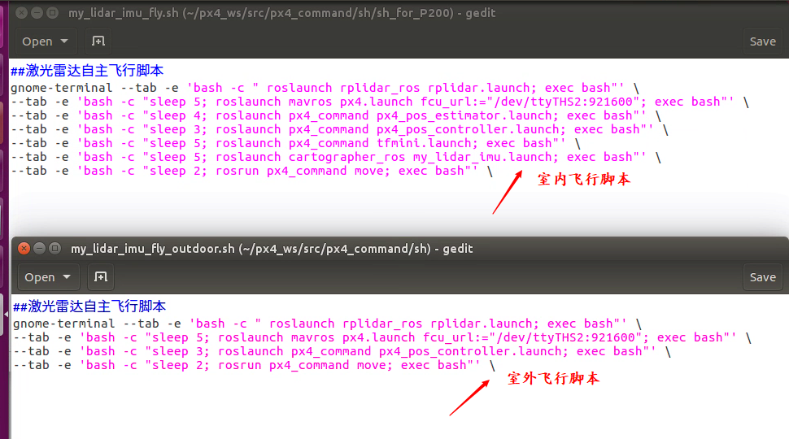
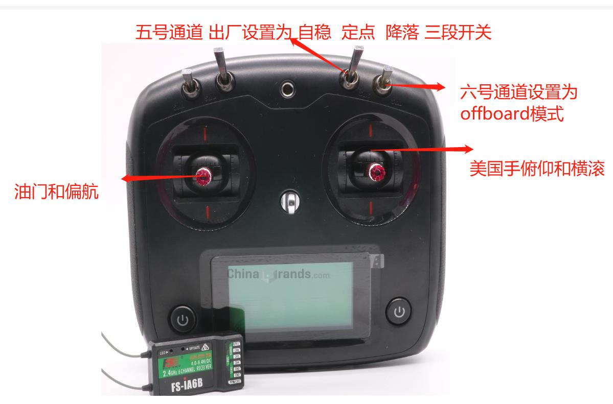
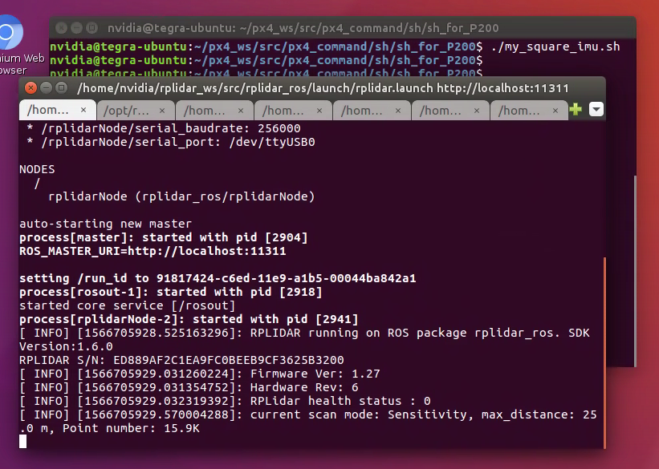
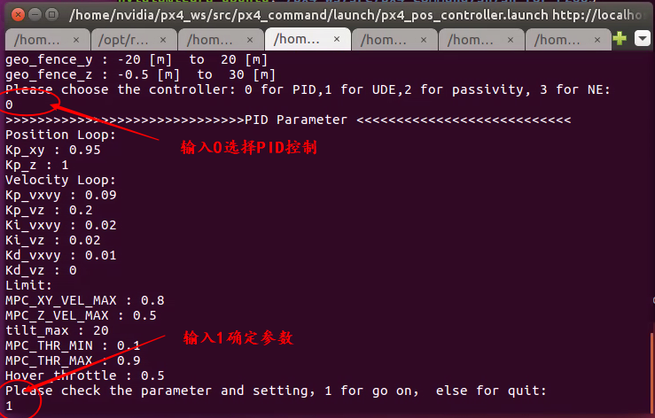
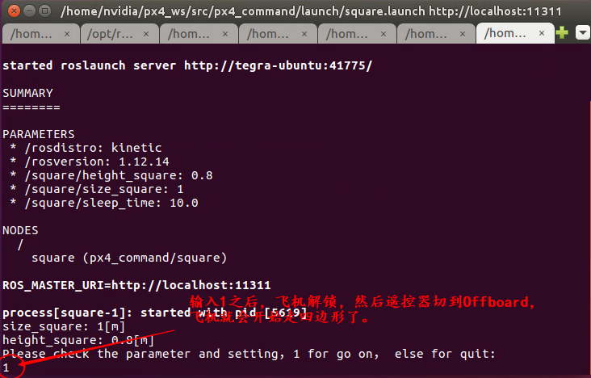
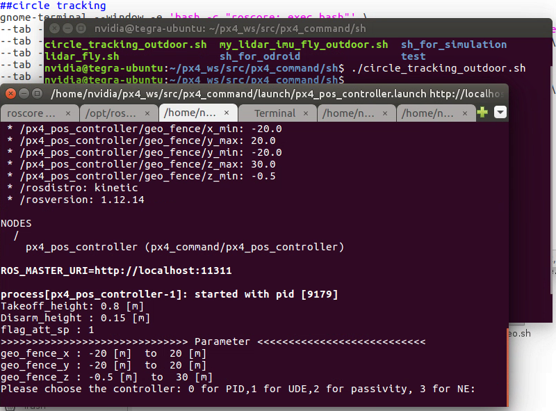
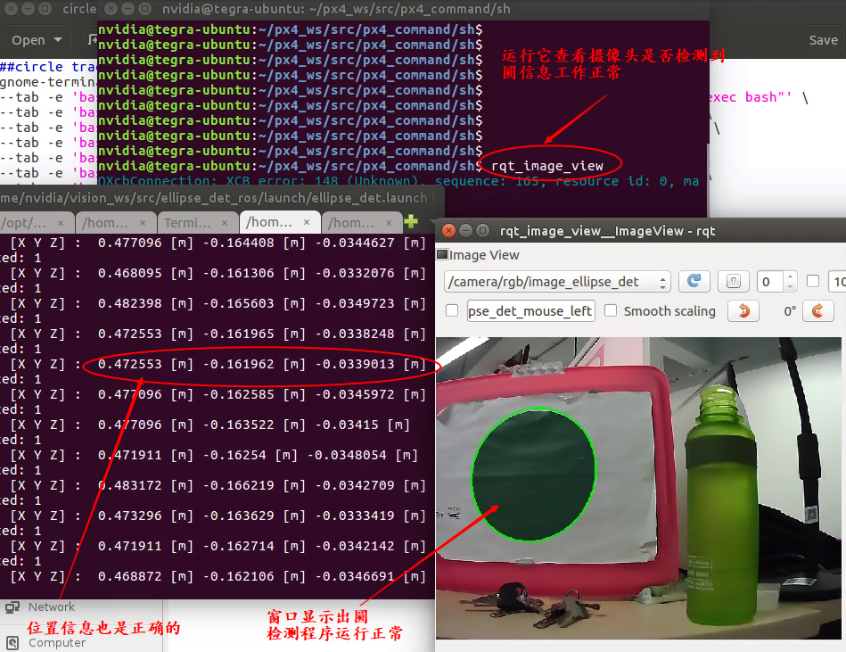
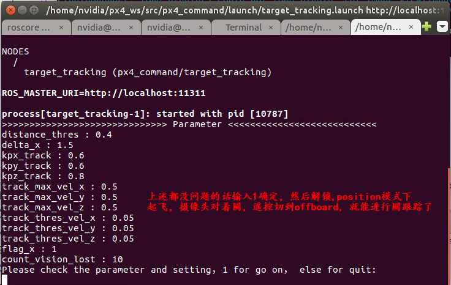

.. px4_command&P200使用说明

==========================
px4_command&P200使用说明
==========================

第一节 基础知识储备
=====================

1 C/C++ / Python
-------------------

2 PX4飞控的简单调试
-------------------

`px4用户手册 <https://docs.px4.io/master/zh/index.html>`_

3 Ubuntu系统的使用
-------------------

4 ROS,MAVROS
----------------

ROS的安装可以参考: `ROS-wiki <http://wiki.ros.org/>`_

ROS的学习可以查看中国大学MOOC： `机器人操作系统 <https://sychaichangkun.gitbooks.io/ros-tutorial-icourse163/content/>`_

MAVROS的学习使用查看: `mavros <http://wiki.ros.org/mavros>`_

5 Git的使用
-------------

.. image:: ../images/git.png

第二节 PX00飞机介绍
===================

1 概述
-------

该科研无人机采用PX4软硬件体系架构,板载计算机为TX2或Nano,配合外部传感器(激光雷达,摄像头),仿真系统采用gazebo或airsim+UE4

.. image:: ../images/P200_Introduce.png

2 硬件
-------

硬件框架

.. image:: ../images/PX00_hardware_framework.png

3 软件
-------

总体软件框架

.. image:: ../images/PX00_software_framework.png

第三节 飞行准备
===================

1 远程连接TX2与QGC
--------------------

需要的硬件:

-   1. 有HDMI接口的显示器一台(用于显示TX2，TX2连接你准备好的路由器的WiFi)
-   2. 带宽比较好的路由器一台
-   3. 安装有QGC地面站与NoMachine电脑一台或两台

连接TX2与QGC:

-   根据WiFi-LINK配置模式有两种连接方式：

a WIFI-LINK配置成无线AP模式
^^^^^^^^^^^^^^^^^^^^^^^^^^^^^^

.. image:: ../images/XBEE_AP_mode.png

这是我们发货时的默认配置，其中WiFi-LINK模块相当与一个热点，笔记本2要连接这个热点进而连接QGC，连接方法可参照 WIFI数传配置无线网卡模式连接路由器.md中第二章第三节。

b WiFi-LINK配置成无线网卡模式
^^^^^^^^^^^^^^^^^^^^^^^^^^^^^^

.. image:: ../images/XBEE_WLAN_mode.png

可看这个教程：WIFI数传配置无线网卡模式连接路由器.md

2 室内飞行
----------

a 环境要求
^^^^^^^^^^^

室内我们采用的激光雷达进行定位，因为采用的二维雷达，会在室内构建出如下的平面地图

.. image:: ../images/LIDAR_layout.jpg

所以在测试以前要选择一个房间大小合适(A1/A2雷达半径12米有效，A3雷达半径25米有效)，房间不能地形非常复杂，也不能没有角点和几何特征点，否则不能很好的构建出地图，就不能很好的定位。

我们的测试环境如下：

.. image:: ../images/Indoor_test_site.jpg

房间内有一些防护装置，房顶的防护网，地面的保护垫等等最好具备，防止伤人和损坏飞机。

b PX4参数调整
^^^^^^^^^^^^^^^

经过上一节假设你已经成功连接上了QGC以及板载计算机了，若遇到困难请上论坛求助： `阿木社区论坛 <http://bbs.amovauto.com/>`_

室内激光雷达定位模式

-   EKF2_AID_MASK = 24 （选择位置以及偏航来源） ； EKF2_HGT_MODE = Vision（选择高度来源）   
-   限制飞机在position模式下的速度以及倾角 ：MPC_TILTMAX_AIR=8、MPC_XY_VEL_MAX=1、MPC_ZVEL_MAX_UP=1

参数确定后尝试解锁，遇到解锁不成功，看看提示是否需要重新校准磁罗盘？解锁成功，电机启转，这时切记不要上浆试飞，
因为此时激光雷达没有工作，没有给飞控送入位置以及高度信息，所以此时姿态控制失效，飞机一飞就会偏。这是我们固件
的bug，近期会修复，请注意。

c 板载计算机调试

把飞机放在室内待起飞点，远程已连接好板载计算机与飞控。

在板载计算机系统里打开终端进入如下图所示目录并启动脚本：

::

    ./my_lidar_imu_fly.sh

脚本会依次启动各个launch文件

正常情况下各个窗口会正常工作，其中有个 **px4_pos_estimate** 节点要特别注意，如下图。

.. image:: ../images/indoor_px4_pos_estimate_failed.png

当出现上述问题，需重新启动飞控以及脚本,飞控的重启需要在地面站的控制台上，输入 **reboot** 然后回车即可。

.. image:: ../images/qgc_reboot_vehicle.png

3 室外飞行
-----------

a 环境要求
^^^^^^^^^^^^

室外开阔地带GPS搜星良好。

.. note::

    key：室外如果要测试圆跟踪或其他的需要用到板载计算机的功能，那么你需要
    根据 **远程连接板载计算机与QGC** 那一节准备就序，当然如果你只是想
    测试飞机的姿态或定位，那你只需要一个遥控器即可，不过需要修改下节中
    PX4的若干参数。

b PX4参数调整以及脚本修改
^^^^^^^^^^^^^^^^^^^^^^^^^

-   源PX4参数调整：EKF2_AID_MASK = 1（选择位置以及偏航来源）； EKF2_HGT_MODE = Barometric pressure（选择高度来）
-   脚本修改：因为室外飞行我们不需要激光雷达和tfmini来定位定高，所以把相关的节点关闭即可。

第四节 功能调试
==================

1 室内遥控position(定点)模式飞行
---------------------------------

启动脚本如下:

::

    ./my_lidar_imu_fly.sh

解锁后遥控器切到Position模式，油推到中位值以上，飞机就会起飞。

2 室内offboard(板外)模式走四边形
---------------------------------

确保 **px4_pos_estimate** 节点的数据正确。

在如下路径中启动脚本:

::

    ./my_square_imu.sh

然后在 **px4_pos_controller** 节点中确定参数

最后确定并开始走四边形

.. warning::

    走四边形之前要确保室内Position模式飞机能够定住，因为飞行环境不同
    ，走四边形的过程中，飞机可能会发散，所以要时刻准备切回`Onboard`

3 室外offboard(板外)模式跟踪圆
---------------------------------

根据上一章 **飞行准备** 中的 **室外飞行** 准备就绪.需要准备一个大小
有要求的圆一个

以防万一，安全绳若干米，栓在飞机腿上。

脚本修改与启动

复制脚本 **circle_tracking.sh** 改名为 **circle_trancking_outdoor.sh**

修改内容如下图:

然后启动脚本,

::

    ./circle_trancking_outdoor.sh

然后运行

::

    rqt_image_view

查看圆检测是否正常。

最后

.. note::

    其实室内也可以进行圆的跟踪，但是因为是激光雷达给的位置信息，
    所有不确定因素比较多，测试时要小心。

.. warning::

    1. 飞机上电(电池采用4S电池，满点电压为16.8V,电池空电电压为14.4V)，飞机低于14.4V
    必须充电，飞机上的电压指示等灭了必须充电。同时系统欠缺电压的化(低于14.4V)，电压监测
    模块会报警，滴.滴.滴的声音！切记这时候要给飞机充电，否则会损坏电池。

    .. image:: ../images/LowBattery_warning.jpg

    2.在室内飞行时tfmini定高模块原理是激光的发射与接收，所以飞行时，不能让tfmini照到
    能够反射光的地板上。如果你不能确定，你可以查看如下图`tfmini.launch`的节点，
    然后拿起飞机来回垂直上下，看看有没有错误的数据。

    .. image:: ../images/indoor_tfmini_detection.png
