.. WIFI数传配置无线网卡模式连接路由器

====================================
WIFI数传配置无线网卡模式连接路由器
====================================

第一节 概述
==============

下图为P200，WIFI数传配置成无线网卡模式下的通信链路，
保证数传、英伟达的IP要在同一个网段上即
192.168.10.xxx要和路由器相同。

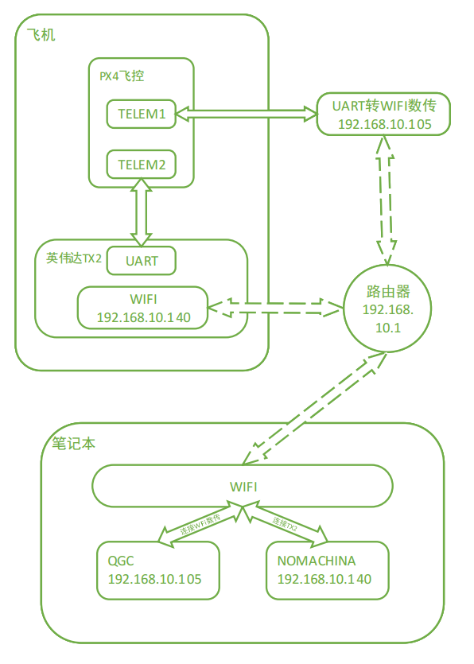

第二节 配置操作
===============

1 路由器设置
--------------

如图为 无线WiFi路由器默认IP地址为192.168.10.1，
登录到此路由器的后台，用已连接此WiFi的手机或电脑
登陆地址wifi.wavlink.com（默认密码为admin）。

WIFI设置：设置WiFi的名称（此名称会在数传设置中用到）
加密方式选择WPA2-PSK

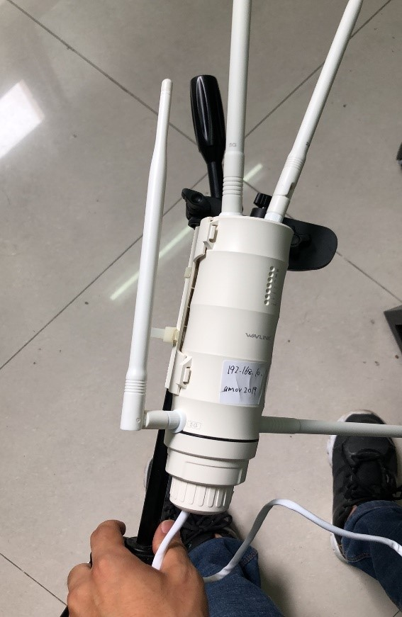

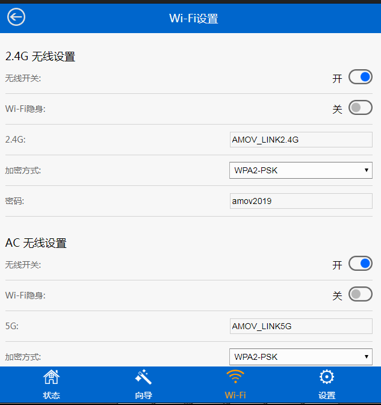

2 WiFi数传设置
-----------------

-   硬件连接

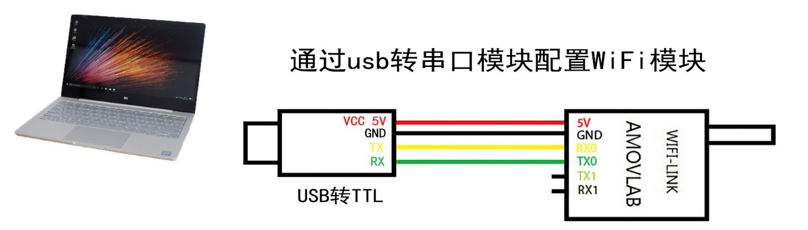

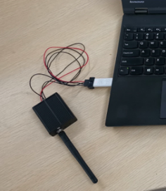

可用四根杜邦线连接usb转TTL与WiFi-LINK，下图是线序

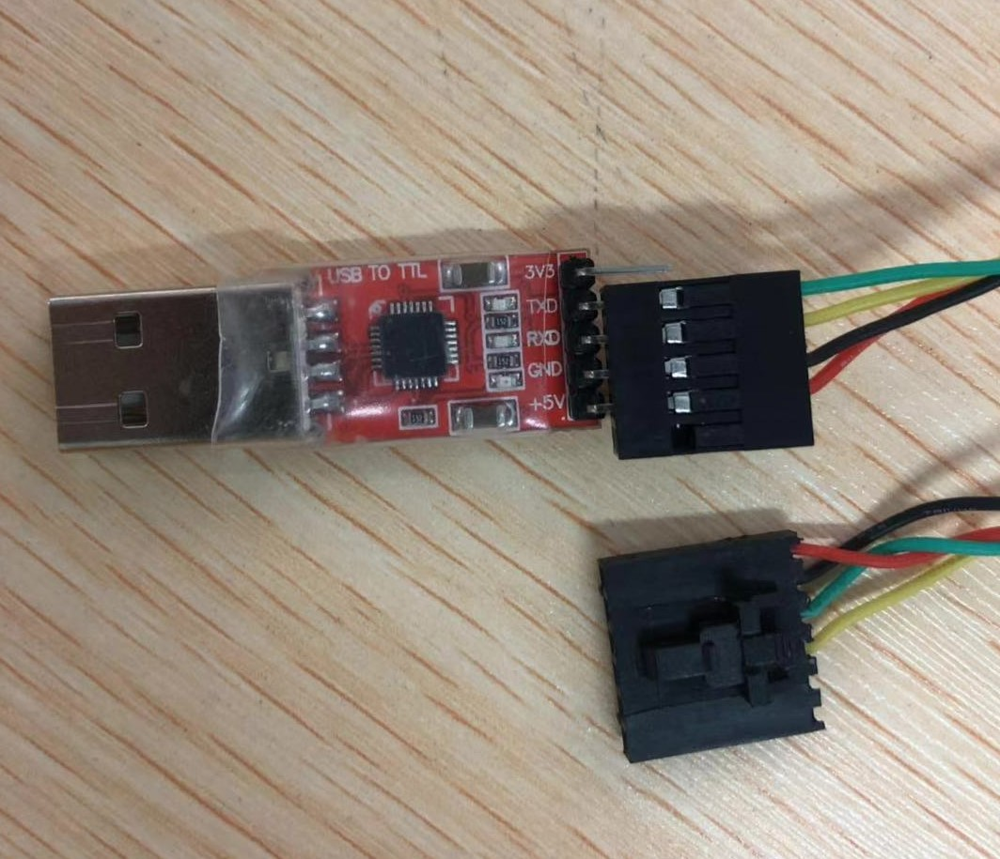

-   软件配置

打开配置软件RM08K config tool CN V2.1.exe

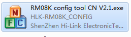

选择相应的COM口使用一个细长的金属棒或者牙签点击WiFi数传
模块的reset按钮（模块上远离天线的那个孔），然后点击搜索
模块按钮，软件显示如下（Found Device at COMX(57600)）
说明连接成功。

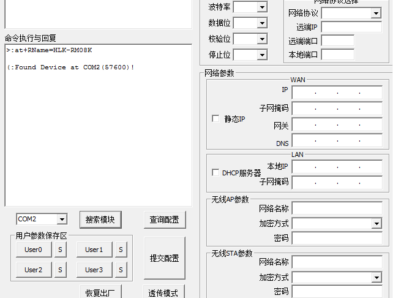

然后下图所示配置你们的WiFi数传，其中网关要选择你的路由器
的网段，网络名称及密码设置你的WiFi路由器的名称与密码，
其中加密方式选择WPA2_AES。

设置完成后点击提交配置即可。

接下来测试是否配置成功：重启WiFi数传，假设你配置成功，
那么WiFi数传会自动连接WiFi路由器。那么我们用连接此
WiFi路由器的笔记本，打开终端(cmd)，输入ping 192.168.10.105 
尝试ping一下我们的WiFi数传，ping通了，那么恭喜你搞定了，
ping不通那么你需要打开 RM08K config tool CN V2.1.exe 
重新配置一下，可以点击查询配置，看看配置的是否有出入。

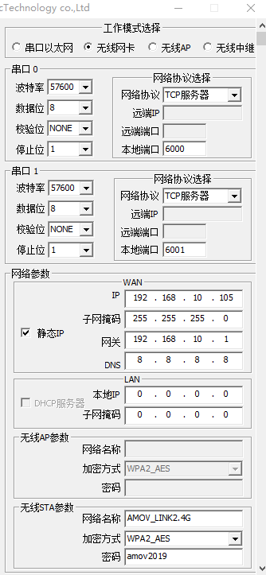

3 地面站以及NoMachine设置

-   地面站连接:此步骤需要笔记本连接WiFi路由器的后才可进行，而且你已经在笔记本上ping通了WiFi数传。

打开QGC，如下图操作。 

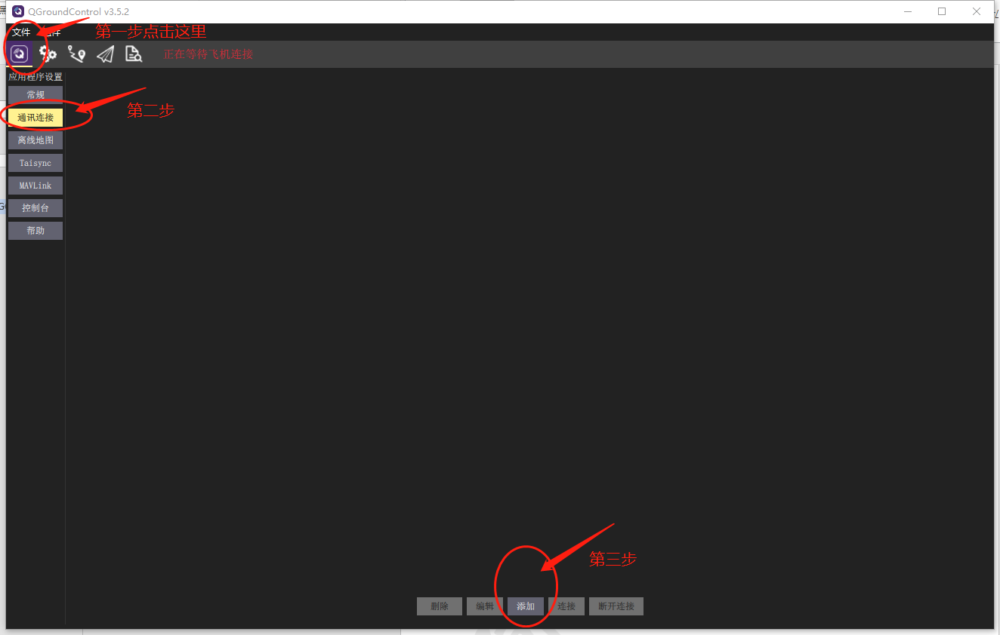

然后选择TCP类型，名称任意，主机地址为你设置得到wifi数传
的IP地址，端口为6000，然后确定即可。

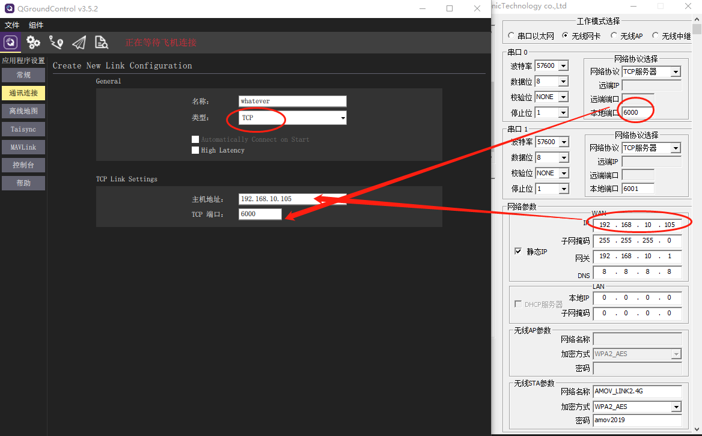

点击你的配置名称，然后点击连接，即可连接飞控了。

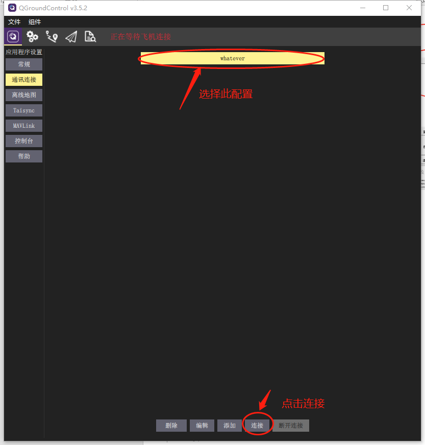

-   NoMachine配置:此步骤需要英伟达TX2中的Ubuntu系统连接成功WiFi路由器，并在终端上输入ifconfig命令找到TX2的IP（我的TX2 IP为192.168.10.140）。

打开NOMACHINA软件，点击 New新建

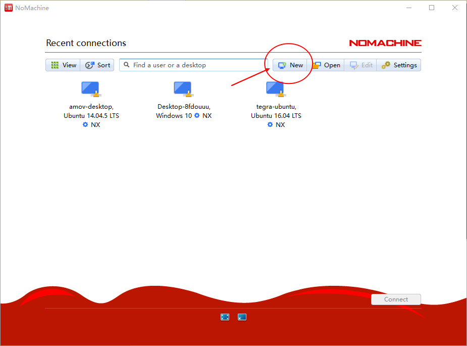

Protrocol选择NX模式，然后输入TX2的IP地址192.168.10.140，Port默认4000

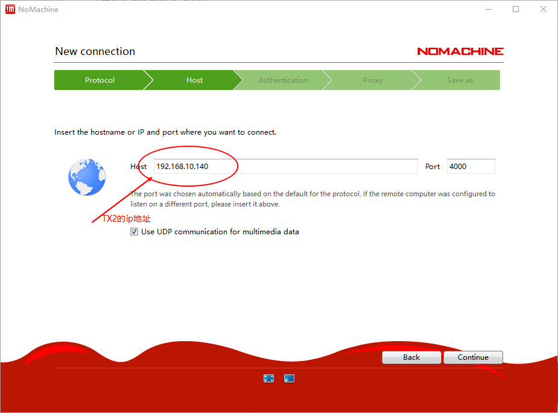

下一步，鉴定方式选择Password，下一步选择Do not use proxy，最后Done

如下选择刚才配置的参数，点击连接

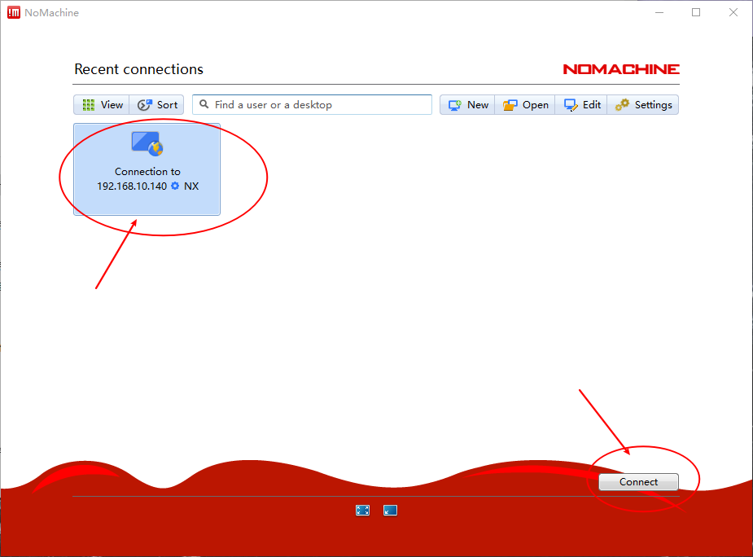

成功后点击YES

输入TX2的用户名以及密码 然后一路OK即可进行访问。

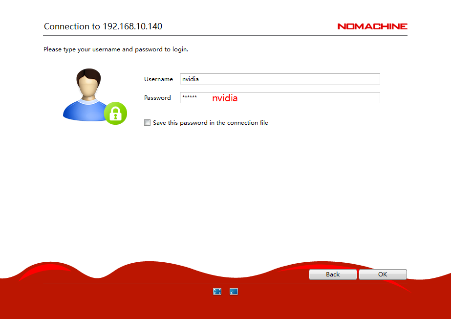

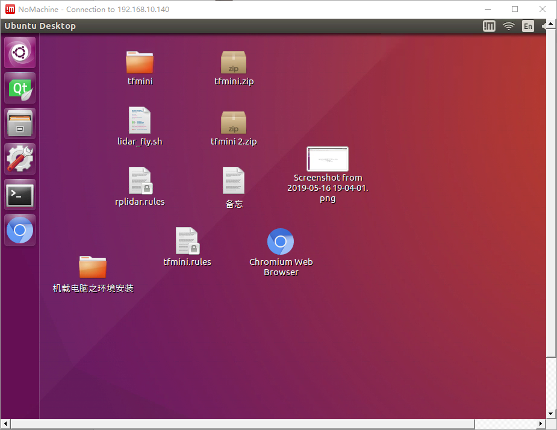

