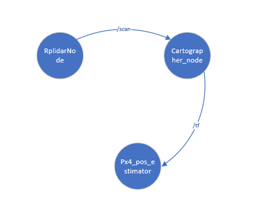
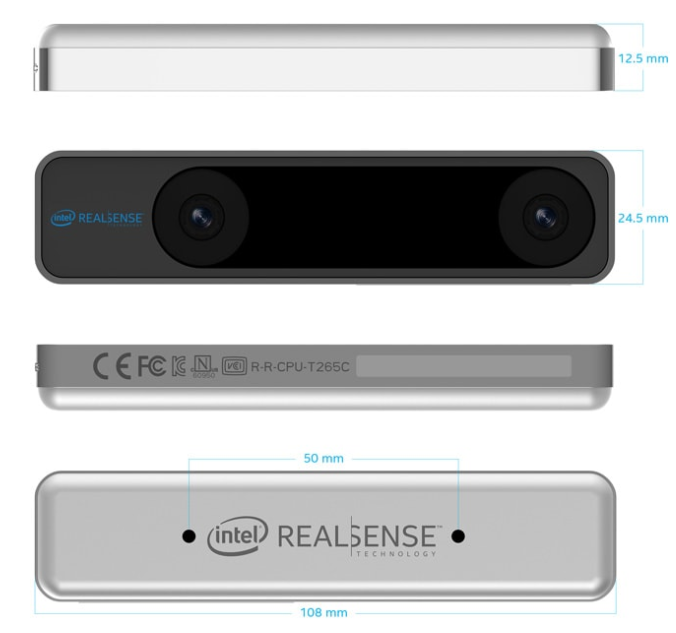
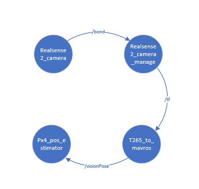
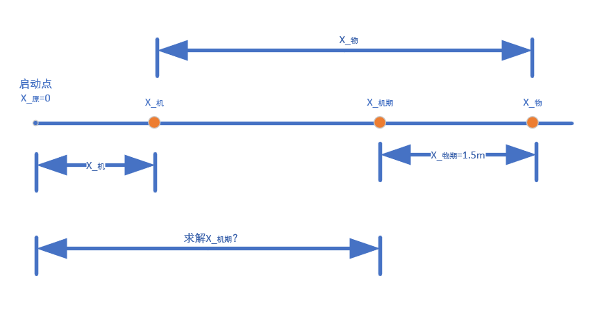
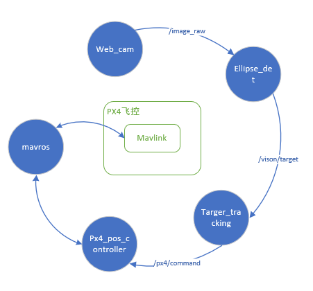
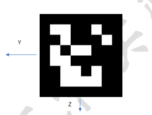
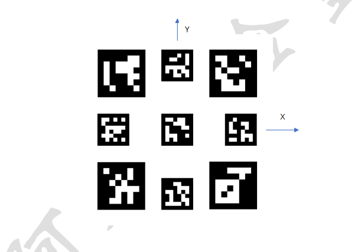
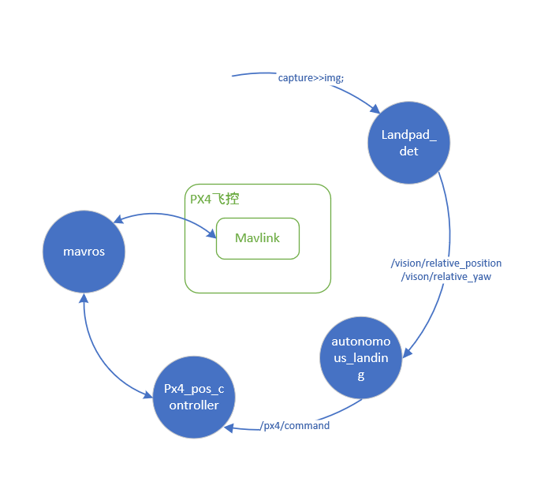

.. px4_command&项目总览

=======================
px4_command&项目总览
=======================

第一节 总体概述
===============

px4_command功能包是一个基于PX4开源固件及Mavros功能包的开源项目，旨在为PX4开发者提供更加简洁快速的开发体验。
目前已集成无人机外环控制器修改、目标追踪、激光SLAM定位、双目V-SLAM定位、激光避障等上层开发代码、后续将陆续推
出涵盖任务决策、路径规划、滤波导航、单/多机控制等无人机/无人车/无人船科研及开发领域的功能。
配合板载计算机(树莓派、TX2、Nano)等运算能力比较强的处理器，来实现复杂算法的运行，运行得到的控制指令通过串口或者网口通信发送给底层控制板。

第二节 软件框架
================

.. image:: ../images/framework.png

-   **state_from_mavros.h**:订阅飞控状态,包括无人机当前的状态(/mavros/state),当前位置(/mavros/local_position/pose),当前速度(/mavros/local_position/velocity_local),和当前角度,角速度(/mavros/imu/data)
-   **command_to_mavros.h**:发布px4_command功能包生成的控制量至mavros功能包,可发送期望位置,速度(本地系与机体系),角度,角速度,底层控制(遥控器输入)
-   **px4_pos_estimator.cpp**:订阅激光雷达或者mocap发布的位置信息,并进行坐标转换,在state_from_mavros.h中已订阅飞控发布的位置,速度,欧拉角信息,此处直接使用,根据订阅的数据,发布相应的位置,偏航角给飞控
-   **px4_pos_controller.cpp**:订阅由位置估计发布的DroneState,初始化当前飞机状态的时间.订阅ControlCommand(不知从何发布的数据).发布topic_for_log主题.在选择控制率,检查参数正确后,初始化完成.对move节点中,takeoff,Move_ENU,Move_Body,Hold,Land,Disarm,PPN_land和Trajectory_Tracking等进行逻辑处理.
-   **ground_station.cpp**:订阅自定义日志主题(/px4_command/topic_for_log),订阅视觉系统位置估计PoseStamped主题(/vrpn_client_node/UAV/pose,非mavlink消息,数据包括point位置(x,y,z),四元数方向(w,x,y,z)),订阅飞控姿态四元数AttitudeTarget主题(/mavros/setpoint_raw/target_attitude,#82号mavlink消息).不断的更新视觉传感器状态,并打印当前飞机的状态.
-   **px4_sender.cpp**:订阅自定义消息控制指令主题(/px4_command/control_command),机体系到惯性系坐标转换,move中控制命令的具体实现(0表示位置控制,3表示速度控制)
-   **autonomous_landing.cpp**:降落识别使用xyz均为速度控制.订阅数据包括降落板与无人机的相对位置,降落板与无人机的相对偏航角,视觉flag 来自视觉节点.最后发布位置控制指令
-   **collisiom_avoidance_streo.cpp**:订阅/streo_distance该数据作为计算飞机四个方向的距离判断.
-   **formation_control_sitl.cpp**:多机仿真SITL,只适用于Move_ENU坐标系下,若使用Move_Body,需自行添加修改.
-   **payload_drop.cpp**:订阅/mavros/local_position/pose本地位置.发布遥控器通道值.
-   **square.cpp**:发布/px4_command/control_command命令.子模式xyz均为位置控制.
-   **target_tracking.cpp**:
-   **move.cpp**:发布/px4_command/control_command,并设置子模式xy速度控制(0b10),位置控制.z速度控制(0b01),位置控制
-   **set_mode.cpp**:模拟遥控器,根据mavros服务,进行在SITL下解锁,切换offboard,控制飞行器.
-   **TFmini.cpp**:激光定高雷达的处理,如果需要添加超声波传感器,可参考此代码.

1 下载编译
-----------

a 通过二进制的方法安装Mavros功能包
^^^^^^^^^^^^^^^^^^^^^^^^^^^^^^^^^^

请参考:`mavros的github <https://github.com/mavlink/mavros>`_

如果你已经使用源码的方式安装过Mavros功能包,请先将其删除.

b 在home目录下面创建一个名为 **px4_ws** 的工作空间
^^^^^^^^^^^^^^^^^^^^^^^^^^^^^^^^^^^^^^^^^^^^^^^^^^

::

    mkdir -p ~/px4_ws/src
    cd ~/px4_ws/src
    catkin_init_workspace

大部分时候,需要手动 **source** ,打开一个新终端

::

    gedit .bashrc

在打开的 bashrc.txt 文件中添加 source /home/$(your computer name)/px4_ws/devel/setup.bash

c 下载并编译 **px4_command** 功能包
^^^^^^^^^^^^^^^^^^^^^^^^^^^^^^^^^^^^^^^

::

    cd ~/px4_ws/src
    git clone https://github.com/amov-lab/px4_command
    cd ..
    catkin_make

2 位置估计
------------

GPS在室外可以进行多传感器融合,最后给到飞控内部,得到本地位置的信息.但除了GPS之外的位置数据源构建的一个基于px4的系统,
我们将其称之为外部位置估计系统,例如vicon,optitrack之类的运动捕捉系统,还有像二维激光雷达系统,双目vio之类的基于视觉
的估计系统.

位置估计既可以来源于板载计算机,也可以来源于外部系统.这些数据用于更新机体相对于本地坐标系的位置估计.来自与视觉或者运动
捕捉系统的yaw角信息也可以被融合到姿态估计器当中.

我们所使用的激光雷达或者mocap系统有关数据融合的部分都在**px4_pos_estimator.cpp**代码中.

3 速度控制与位置控制
---------------------

在px4_command中,控制命令的子模式可以选择位置追踪,速度追踪或者是复合追踪.默认为XYZ位置追踪模式(sub_mode=0).速度追踪为sub_mode=3.
在move中控制,提供了XYZ位置追踪模式(0)或者是XYZ速度追踪模式(3).所谓位置控制就是发布期望的位置坐标点,而速度控制即为一直发布期望的速度飞行,
在仿真中测试可以发现,发布期望的速度,如果速度不重新设置为(0,0,0),那么飞行器是不会停止的,在实际过程中,请谨慎使用此模式控制.复合模式的使用常用在
跟踪条件下,对XY进行发布期望速度,对Z发布期望位置.

4 室内定位(激光/视觉)
----------------------

- 二维激光雷达定位
- Inter T265双目相机视觉定位

二维激光雷达定位
^^^^^^^^^^^^^^^^^^^^^^^^^^^^^^^^^
 

RplidarNode节点主要是驱动二维激光雷达，把扫到的距离信息打包向外发布，cartographer订阅此消息进行运算，解算出飞机的空间位置信息以及航向信息，该信息最终会被px4_pos_estimator订阅进行进一步的运算，其中Google的 `Cartographer官网 <https://google-cartographer-ros.readthedocs.io/en/latest/>`_ 参考。

各个节点对应的工作包或工作空间如下：

- RplidarNode---rplidar_ws
- Cartographer_node---carto_ws 
- px4_pos_estimator---px4_command

Inter_T265双目相机视觉定位
^^^^^^^^^^^^^^^^^^^^^^^^^^^^^^^^^^^^^

 T265相机如图所示

Realsense2_camera节点是驱动T265并发布原始图像、imu，深度图像等信息，Realsense2_cameraz_manage订阅这些信息处理解算出飞机的空间位置并发布，T265_to_mavros接收此topic处理，主要是坐标的转换，目的是与我们飞控的坐标系相匹配，然后px4_pos_estimator进行进一步的处理，主要是选择空间位置来源（是激光雷达来的位置信息或vision来的位置信息）。

各个节点对应的工作包如下：

- Realsense2_camera、Realsense2_camera_manage --- realsense-ros `Realsense驱动ros包 <https://github.com/IntelRealSense/realsense-ros.git>`_
- T265_to_mavros --- vision_to_mavros `T265_to_mavros <https://github.com/hoangthien94/vision_to_mavros.git>`_
- Px4_pos_estimator --- px4_command

5 视觉追踪（单目相机）
----------------------------

以圆形物体检测跟踪为例

- 原理分析
- 软件流程

原理分析
^^^^^^^^^^^^^^

物体目标坐标系是相对飞机质心的位置，向前为X+、向下Z+、向右Y+;
飞机的坐标系是相对启动点的位置，向前为X+、向上Z+、向左Y+;

**注：所在观察位置在飞机的机后 。**

假设我们用激光雷达或VIO或GPS以及IMU、测高传感器知道了飞机当前的空间位置 
$$
（X_机，Y_机，Z_机）
$$
用单目或双目摄像头解算出物体目标相对飞机的当前的空间位置
$$
(X_物，Y_物，Z_物)
$$
以及当我们给板载计算机输入期望的飞机空间位置时，飞机能够到达指定位置，那么当我们确定期望的物体目标坐标时会发生什么呢？（即物体相对飞机的空间位置不变）假设是：
$$
(X_{物期}，Y_{物期}，Z_{物期}) = （1.5，0，0）
$$
为了简化问题，我们单独拿出X轴来分析，我们建立一维的示意图，如下图我们已知飞机的坐标，物体的坐标，

那么我们就可以求出
$$
X_{机期}+X_{物期}=X_机+X_物
$$

$$
得出：X_{机期}=X_机+X_物-X_{物期}
$$

那么现在我们知道了所要的飞机的期待坐标，以及现在时刻飞机的坐标，接下来无非就是PID，控制率的问题了。

软件流程
^^^^^^^^^^^^^^^^

web_cam节点是驱动单目相机并发布原始图像信息，ellipse_det对原始图像进行处理，检测圆形物体并发布此物体相对飞机的位置信息。Target_tracking节点负责根据物体的位置，以及期望位置发布飞机的期望位置给px4_pos_controller，进而通过movros与飞控通信达到控制飞机的到指定点的目的。

各个节点对应的工作包或工作空间如下：

- web_cam --- ros_web_cam
- ellipse_det --- ellipse_det_ros
- Target_tracking、px4_pos_controller --- px4_command

6 视觉引导降落
----------------

- ArUco Marker检测

- 降落板引导降落软件流程

ArUco Marker检测
^^^^^^^^^^^^^^^^^^^^
Marker的坐标系定义为：
垂直于Marker向外为x轴正方向，水平向左为y轴正方向，竖直向下为z轴正方向,Marker中心为坐标系原点。 

以10号字典(6X6 250)中id为3的Marker做示意： 

识别由九个ArUco Marker组成的降落板，并解算无人机相对于降落板的位置。
降落板的坐标系定义为：
垂直于降落板向上为z轴正方向，水平向右为x轴正方向，水平向前为y轴正方向,降落板中心为坐标系原点。 

将降落板图片按照60cmX60cm打印出来。
在摆放时需要将降落板的x轴正方向（即向右的方向）与无人机机头朝向一致。 

降落板引导降落软件流程
^^^^^^^^^^^^^^^^^^^^^^^^^^

其中landpad_det是用来识别由九个ArUco Marker组成的降落板，并解算无人机相对于降落板的位置。

发布降落板与无人机的相对位置以及降落板与无人机的相对偏航角，然后autonomous_landing定义这些topic进行处理并发布控制指令，控制无人机降落。

各个节点对应的工作包或工作空间如下：

- landpad_det --- landpad_det_ros
- autonomous_landing、px4_pos_controller --- px4_command

备注：

在运行主节点的情况下输入roslaunch landpad_det landpad_det.launch 运行节点

通过输入命令 rqt_image_view 可查看可视化检测结果
选择/camera/rgb/image_landpad_det话题 

7 深度学习追踪
----------------

第三节 硬件链接
===============

1 硬件外设
------------