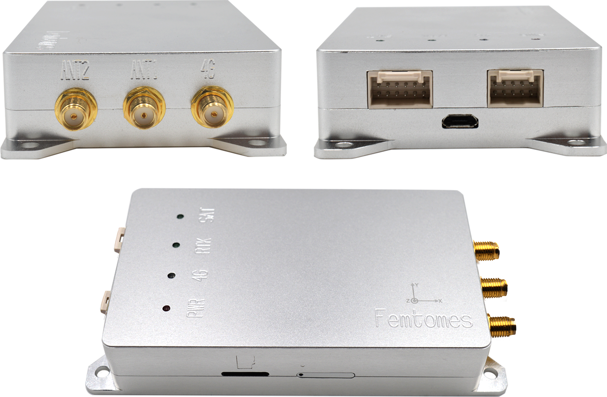
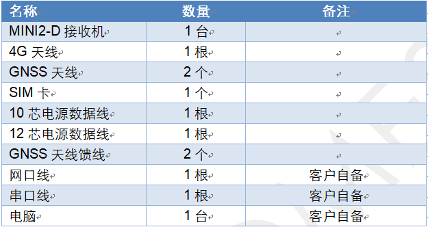
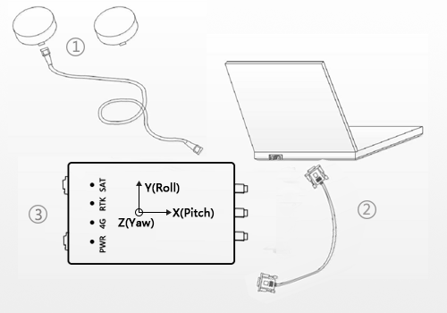

.. 可选配件:

===============
可选配件
===============

可选配件1--RTK
==================

第一节 px4-rtk使用介绍
-----------------------

1 参数说明
^^^^^^^^^^^^^^

2 建议飞控参数
^^^^^^^^^^^^^^

第二节 市面常用产品对比
-----------------------
1 参数
^^^^^^^^^^^^

2 关键参数
^^^^^^^^^^^^

3 视频
^^^^^^^^^^^

第三节 RTK产品介绍
-------------------

1 产品图片
^^^^^^^^^^^^^

2 产品参数
^^^^^^^^^^^^^

-   接收卫星信号 
    GPS L1 / L2 
    BDS B1 / B2 
    GLONASS L1 / L2 
-   单频定位 (RMS) 
    平面 1.5m 
    高程 3.0m 
-   双频定位 (RMS) 
    平面 1.2m 
    高程 2.5m 
-   DGNSS(RMS) 
    平面 0.4m 
    高程 0.8m 
-   RTK (RMS) 
    平面 10mm +1ppm 
    高程 15mm +1ppm 
-   定向精度 (RMS) 0.2° / 1m 基线 
-   速度精度 (RMS) 0.03m/s 
-   时间精度 (RMS) 20ns 
-   惯性导航精度 < 5% x 行驶距离
    ( 无 GNSS 信号 30s 内 )
-   测量精度 (RMS) BDS GPS GLONASS

    +   B1/L1 C/A 码 10cm 10cm 10cm
    +   B1/L1 载波相位 1mm 1mm 1mm
    +   B2/L2P(Y) 码 10cm 10cm 10cm
    +   B2/L2 载波相位 1mm 1mm 1mm
-   初始化时间 小于 10 秒 ( 典型值 )
-   首次定位时间 

    + 冷启动：40s ( 典型值 )

    + 温启动：30s ( 典型值 )

    + 热启动：5s ( 典型值 )

-   差分数据 RTCM2.x/3.x CMR CMR+
-   数据格式 

    +   NMEA-0183
    +   Femtomes ASCII 及 binary 格式
-   数据更新 1Hz / 5Hz / 10Hz / 20Hz（可选）
-   组合导航 /IMU 原始数据更新 最高支持 200Hz

3 使用视频
^^^^^^^^^^^^

4 安装要求
^^^^^^^^^^^^
a 器材清单
""""""""""""""""

b 硬件连接
"""""""""""""

5 价格,购买链接
^^^^^^^^^^^^^^^^^^

6 配套软件
^^^^^^^^^^^^^^
FemtoMonitor.exe

第四节 使用方法
----------------------

1 使用说明
^^^^^^^^^^^^^^^^^^^

2 配件说明
^^^^^^^^^^^^^

第五节 产品分析方法
--------------------

第六节 讨论区
--------------------

第七节 github源码
--------------------

可选配件2--网口图传
===================

资料后续有待补充
