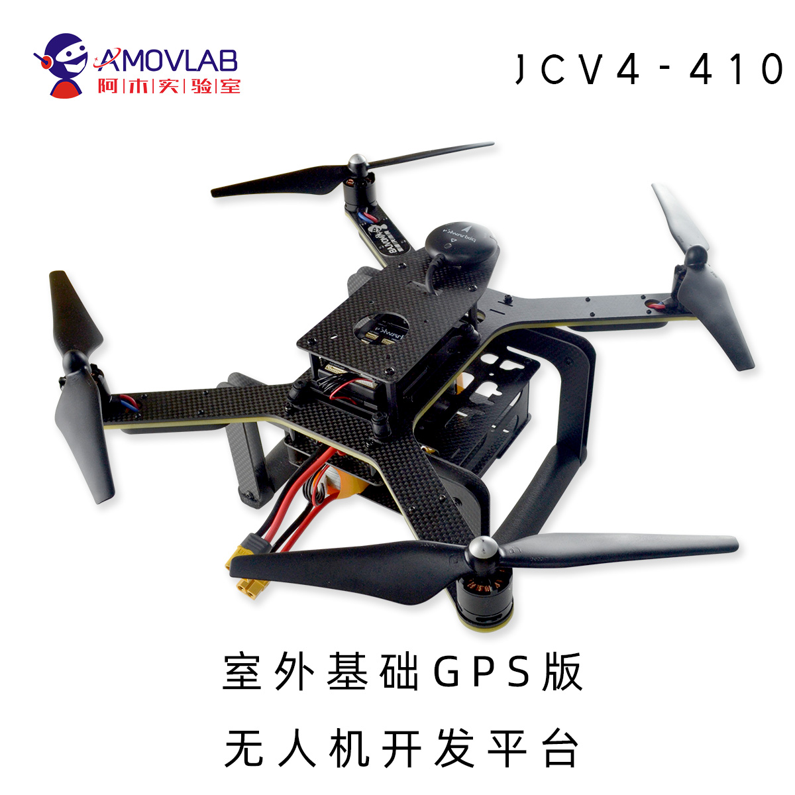

.. 新手入门:

============
新手入门
============

专业名词解释
=============

aircraft:任何可以飞或者可以携带物品还是搭载旅客的飞行器统称为飞机(航空器).

uav:无人驾驶飞机

vehicle:飞行器

airplane/plane/aero-plane :有机翼和一个或多个引擎的飞行器统称为飞机

Drone:无人航空器,典型的有四旋翼,六旋翼,飞机模型,固定翼,垂起,直升机模型

aerial:空中的,从飞机上的.

**四旋翼(Quadcopter)** :无人驾驶飞行器,一般带有四个螺旋桨和一个电子稳定系统

多旋翼:无人驾驶飞行器,带有一个电子稳定系统和螺旋桨的数量取决于三旋翼,四旋翼,六旋翼,八旋翼或者更多.

飞行控制器/自动驾驶: 

-   1.设计了用于控制多旋翼,飞机或者是其他飞行器的一种专用电路板,例如:pixhawk,Ardupilot,Naze32,CC3D
-   2.多旋翼控制的软件,例如:PX4,APM,CleanFlight,BetaFlight.

固件:主要用于嵌入式系统的软件,例如:飞控系统,电调系统(ESC)

电机:旋转多轴螺旋桨的电动机,通常使用的是无刷电动机,这些电机需要电调.

电调/电机控制器:ESC,电子调速控制器,用于控制无刷电机速度的专用电路板.它使用PWM飞行控制器控制.

电池:无人机航空器的可充电电池.四旋翼常用的是LiPo锂电池

电池芯数:无人机航空器常用的电芯数(2s~6s),每节锂电池的最大电压4.2V,正常充电电压3.7V,电池的电压是每节锂电池电压串联的总和,P200无人机使用的是4s锂电池

遥控器/无线电控制设备:远程遥控操控四旋翼的设备,我们称为遥控器.远程遥控器控制的的前提是接收机需要连接到飞控中.P200无人机使用的是富斯i6s.

遥测设备:

解锁:Arming,飞机准备飞行的状态,当遥控器慢慢推动油门摇杆时或者发送带有目标点的外部命令时,飞机将开始飞行.通常解锁的操作是,油门最低+偏航角最大,一般情况下,解锁之后螺旋桨会以怠速转动,与之相反的状态是上锁,Disarmed

PX4:非常流行的开源飞控代码,它可以在pixhawk系列嵌入式主板中运行.P200所使用的就是pixhawk4嵌入式主板.

NVIDIA TX2/NANO:性能较强大的板载计算机,也是P200中所使用的板载计算机.

APM/Ardupilot:最开始的时候是为Arduino开发板创建的开源飞控.现在也可以兼容pixhawk系列嵌入式主板.

Mavlink:无人航空器,地面站以及通过无线信道的其他设备相互间通信协议,Mavlink是一个用于无人机的通讯协议，在这个通讯协议下有很多很多消息类型。外部与飞控建立连接，绝大部分是利用Mavlink协议，传递的是Mavlink消息。比如：地面站、
mavros

ROS:编写复杂机器人应用程序的流行框架.Robot Operating System (ROS) 
是一种得到广泛使用的机器人操作与
控制系统软件框架。其提供了一个标
准的操作系统环境，包括硬件抽象、
底层设备控制、通用功能的实现、进
程间消息转发和功能包管理等.

mavros:连接ROS和mavlink协议之间的库.

uORB:uORB是一种类似ROS主题的发布,订阅机制,但大大简化了其复杂性并将其应用到嵌入式环境之中.

硬件介绍
===============

主要向介绍三款科研无人机开发平台,第一款是型号为P200-A2-TX2的P200系列无人机

.. image:: ../images/P200_Hardware_framework.png

该无人机包含有pixhawk4基础套件,完成px4最基本的飞行功能;其次有激光雷达rplidar A2,在室内完成激光雷达slam定位;单目视觉相机基于openCV的图像识别,视觉引导降落等;板载计算机
NVIDIA TX2作为核心来处理这些外部设备获取到的原始数据,最后通过mavros发送至飞控之中.在板载计算机中包含有视觉处理ROS包,rplidarROS包,cartag算法ROS包,以及核心控制功能包px4_command.

更多详细参数,功能可以查看 `淘宝 <https://item.taobao.com/item.htm?spm=a312a.7700824.w4004-18545444955.8.2381f907Cp1jvk&id=594293725610>`__ 产品详情.

第二款型号为 JCV4-410 无人机

Amovlab开源无人机开发平台 pixhawk4,同(px4/APM)一键起飞,一键返航,室外定点/定高,mission,电子围栏等能力.具有强扩展空间,支持扩展多种设备.提供科研建模电机拉力参数,配合新课程
基于模型(MATLAB)开发.

更多关于该型号无人机的电机拉力实测表请查看 `淘宝 <https://item.taobao.com/item.htm?spm=a312a.7700824.w4004-18545444955.10.2381f907Cp1jvk&id=591693894635>`__ 产品详情的参数

第三款型号为P200-T265-TX2的P200系列无人机

.. image:: ../images/P200_t265_a2.jpg

硬件清单:

**标配**:

=====================  ========================     ==========      ===========
机体                   P200含电机电调               台              1     
主控                   pixhawk4                     个              1 
GPS                    M8N                          个              1
螺旋桨                 9寸                          支              8
遥控器(含接收机)       富斯I6S                      台              1
遥控器电池             镍氢                         个              1   
镍氢电池充电器         无                           个              1
Intel双目相机          T265                         个              1 
动力电池               4200mAh/4S                   个              1
数传                   WIFI数传(AP模式)             个              1
平衡充电器             B6AC                         台              1
=====================  ========================     ==========      ===========

**选配**:

==================  ===========  ====  =======
板载计算机(二选一)  NVIDIA Nano  个    1          
板载计算机(二选一)  NVIDIA TX2   个    1
激光定高雷达        TFmini Plus  个    1
==================  ===========  ====  =======

**无人机参数**:

====================  ===============================================
无人机外形尺寸        322 X 316 X 197 mm                            
轴距                  410 mm                                
整机重量飞控最大倾角  5'                                  
电机                  SunnSky X2213 KV980 或者 T-Motor Air 2216 KV880                         
螺旋桨                9寸,10寸自锁桨                                           
电调                  Hobbywing 30A                                            
电池                  4200mAh/4S                                       
====================  ===============================================

本科研无人机的更多详细,可以直接去 `淘宝 <https://item.taobao.com/item.htm?spm=a312a.7700824.w4004-18545444955.12.2381f907Cp1jvk&id=605368058395>`__ 查看更多详细参数.

软件介绍
===============

.. image:: ../images/framework.png

px4_command功能包是一个基于PX4开源固件及Mavros功能包的开源项目，旨在为PX4开发者提供更加简洁快速的开发体验。目前已集成无人机外环控制器修改、目标追踪及避障等上层开发代码，
后续将陆续推出涵盖任务决策、路径规划、滤波导航、单/多机控制等无人机科研及开发领域的功能。

**PX4**:非常流行的开源飞控代码,PX4 Firmware可以烧写pixhawk系列嵌入式主板中并运行.它的官方Github固件在 `这里 <https://github.com/PX4/Firmware>`__ .在我们的 `Github <https://github.com/amov-lab/Firmware>`__
中,也 fork 了官网的固件,之后我们修改过的PX4 Firmware会放到该github上面.

ROS是一个平台，不仅提供各种开源代码，还提供开源代码间
互相通信的机制。比如要搭建一个机器人，电机、力传感器、摄
像头这些设备的底层驱动ROS都可以提供；还提供给你PID控制
代码，SLAM算法等等；更牛逼的是他还写了一整套通讯协议，
让你实现各个程序间的通信，你只需要下载这些功能包，写一个
简单的启动脚本，就能运行起来一个机器人系统。

Mavros:就是mavlink与ROS连接的库,无人机与板载计算机就是通过这种方式相互交互的.

我们可以简单的将本无人机中包含的代码分为以下几个部分：**视觉端代码**、**Mavros代码**、**飞控代码**.每一块代码各有分工，一个人也可能可以完全掌握这三部分代码，单需要很长时间。所以根据自己的需求，选择自己要学习的部分，事半功倍。

**视觉端代码**:

视觉端代码这里不叙述，基本一个功能对应一个文件夹或者cpp文件。比如做追踪，我们关心的是目标机体系下的位置，那么视觉端最后的输出就是目标的位置，如果不探讨视觉的具体代码，知道这些就足够了。

**Mavros代码**:

Mavros代码分为上层开发代码，位置环代码，底层代码。底层代码是下载mavros功能包时就有的（但我们也有一些小修改，具体看配置文件夹），位置环代码和上层开发代码是我们提供的核心代码。其中，位置环代码是我们移植了PX4中的位置环串级PID算法，然后二次封装了一些接口供用户使用，上层代码则是针对具体应用（如追踪、降落、避障等）。

**飞控代码**:

飞控中代码的修改和优化没有太大的必要，除非有对底层修改的必要，本无人机中只是针对特定的部分进行了修改。但是需要了解：飞控中的数据流

安全指引
===============

飞行试验前你要做的：

1.稳固的机架。做实验，特别是开发性质的实验，炸机是难免的，即使不炸机也常常会有不正常降落（紧急情况下从offboard切换回手动，或者直接kill电机），从个人开发经验来看，机架要耐摔耐撞比较重要。由于是室内飞行，一般飞行高度会在0.5-2米之内，P100直接断电降落也不会对飞机造成太大了影响，可能螺丝会松以及粘贴的零部件会松，不会造成大的损伤。所以飞行前要检查飞机各个部件是否稳固，飞机螺旋桨是否会割到某些线。

2.手动试飞。一个无人机要想能够自主飞行（内环+外环），首先要手动飞行稳定（内环）。如果你不是天天做实验，保证飞机的连续的一个良好的状态，建议每次实验前手动试飞检查一下飞机是否正常。

3.熟悉程序。前两步都没问题，要进行任务级别的开发了（比如追踪等等），首先就是要熟悉程序，带着注释看代码还是很快的，至少了解一下程序的运行逻辑。在不上桨的情况下先测试下程序的运行是否正常。

4.离线测试。基本上每一个程序都有详细的打印界面，会输出传感器或者飞机的状态信息。以追踪为例，在不解锁的情况下，运行所有程序，遥控器切offboard模式，拿一个目标标志物在镜头前面左右摆动，查看程序运行的情况，观察机载电脑给飞控发送的指令是否正确。

以上四步是真正飞行试验前必做的。虽然P200具备一部分到手飞的功能，但是你还是需要去熟悉这台飞机和代码，不然出了问题你根本不知道怎么去解决和优化。

说明:

-   1.P100仍属于开发性质的平台，并不像大疆或者其他商业开源平台那样稳定。所以实验中会遇到各种各样的问题，大部分问题如果通过重启飞控或者程序解决了，就不需要咨询售后了，因为我们也天天遇到。
-   2.做实验是有一定危险的，注意安全第一，紧急情况直接切手动降落.
-   3.我们会陆续提供各个demo的教学视频，更加直观的指导大家操作
-   4.我们也会定期开设自主无人机及mavros培训课程，课上会具体讲授开发流程及注意事项，敬请关注。
-   5.祝大家飞行顺利，愉快！

