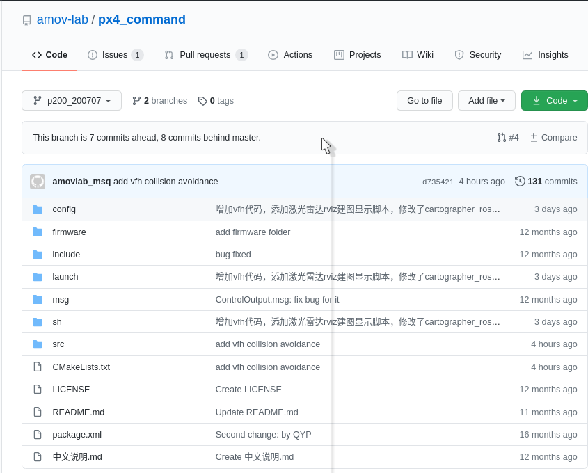
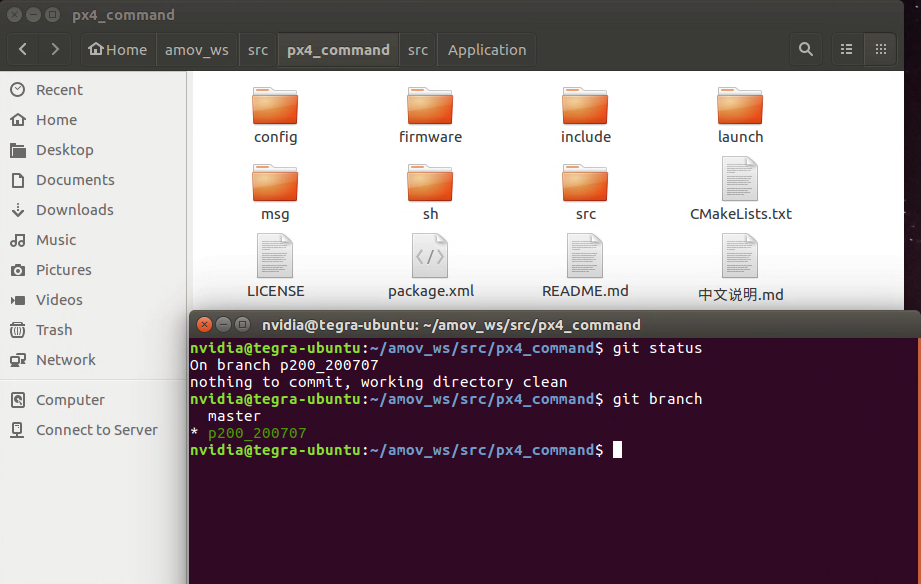
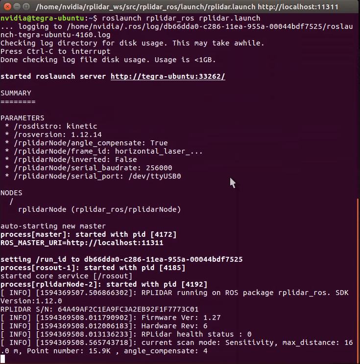
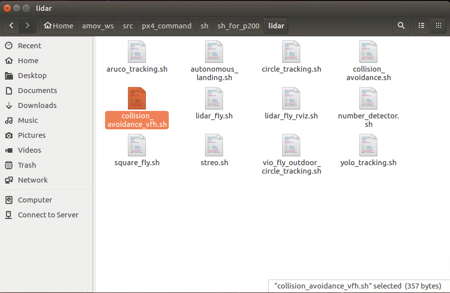
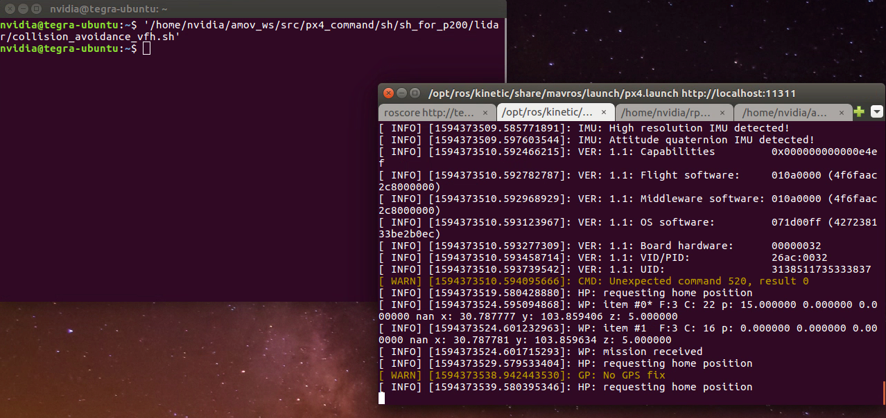
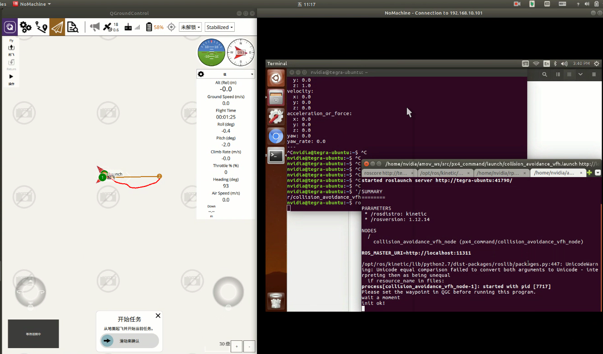
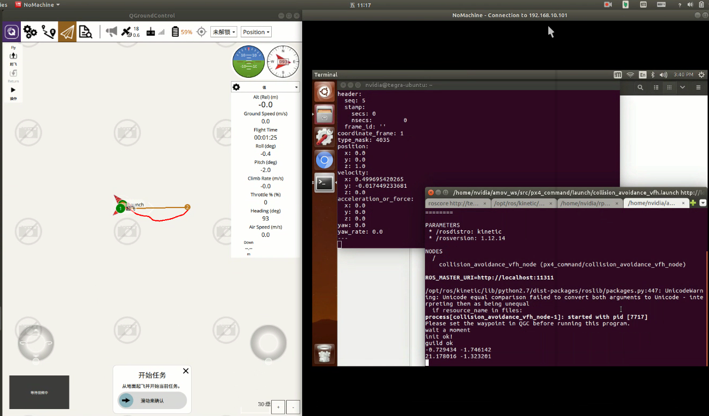
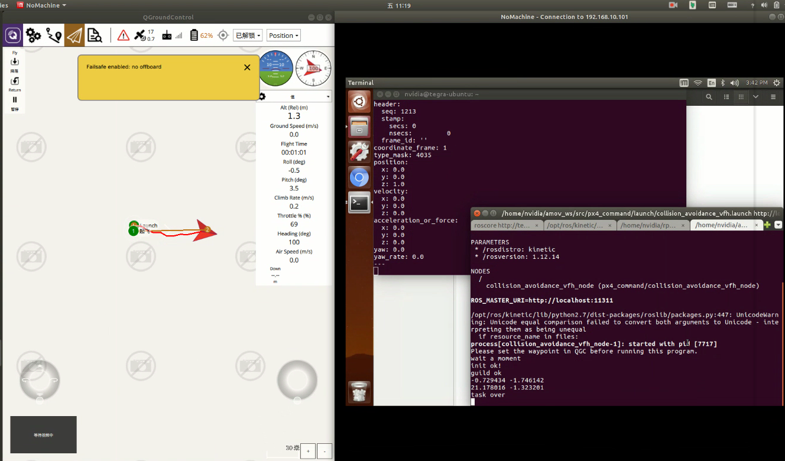

.. 自主飞行之进阶:

===================
自主飞行之进阶
===================

1.vfh避障demo
===================

a.更新px4_command功能包
--------------------------------

px4_command最新功能包在github上面。请点击链接 `px4_command <https://github.com/amov-lab/px4_command.git>`_ ,我们更新的不是master，而是分支 p200_200707 ,如下图：

现在进入到TX2里面，确保能够正常上网，本身有个px4_command功能包，现在我们删除掉原有的px4_command，重新 git clone 最新的功能包。使用 git clone https://github.com/amov-lab/px4_command.git ,
进入到px4_command，切换 p200_200707 分支下面， 使用命令 git checkout p200_200707 .然后退回到 ~/amov_ws 目录之下，使用 catkin_make 编译px4_comman功能包。如下图所示，我们使用的就是p200_200707该分支

b.更新rplidar_ros功能包
----------------------------

我们通常使用的是思岚科技的A2，A3或者S1雷达，不管您是使用A2，A3还是S1雷达做避障，都建议更新一下激光雷达功能包。rplidar_ros的源码地址为 https://github.com/amov-lab/rplidar_ros.git

删除之前rplidar_ws里面的编译生成文件夹build和devel。删除掉src下面的所有文件及文件夹，在 ~/rplidar_ws/src 路径之下下载源码，使用 git clone https://github.com/amov-lab/rplidar_ros.git ,
然后进入到上级目录 ~/rplidar_ws 下面，执行 catkin_make 进行编译，编译完成之后，如果之前没有删除 ~/.bashrc 下面的环境变量，你无需添加新的环境变量。 打开新的终端，使用 roslaunch rplidar_ros rplidar.launch 
启动激光雷达，如下图：

默认的 rplidar.launch 的波特率是 256000 ，我这里使用的是A2的雷达，A2雷达有的是115200，有的是256000.每一款机关雷达底座下面有具体的型号。这里我所使用的是A2M8R4系列，对应波特率为256000.

c.实际避障前说明
------------------------

第一点、激光雷达的的正方向是有连接线的一边，我们称之为激光雷达的尾巴，正确的在飞机机架上的安装方式为，激光雷达的尾巴朝向飞机的机尾。这个很重要，不要搞错了！！！
如果您拿到的飞机，激光雷达的尾巴是朝前的如果要使用室外激光雷达避障功能，请将激光雷达尾巴改为朝向飞机的机尾。一定注意！一定注意！！一定注意！！！

第二点、避障前可熟悉仿真环境中的避障，这个必须要配置一下仿真环境。也可以学习 `无人机仿真课程开发 <https://bbs.amovlab.com/plugin.php?id=zhanmishu_video:video&mod=video&cid=18>`_ ，里面有降到vfh的无人机避障教程。这个是为了让你熟悉避障的整个流程和逻辑。

第三点、在避障过程中我们控制的是飞机的水平xy速度，高度z保持一定值不变。在室外使用地面站 QGroundControl 规划一条航线。正常情况下飞机按照这个规划航线飞行，现在如果中途有障碍物，飞机会自行绕开这个障碍物。我们可以实时打印出ros topic,rostopic echo /mavros/setpoint_raw/local
这个可以方便我们查看offboard模式下，tx2通过激光雷达给飞控发送了水平方向的速度是怎么变化的。

第四点、飞机整体性能都没问题，怎么判断呢？就是正常的自稳下飞行可控，position下面飞行的还挺稳定，GPS飘的不是太大。

第五点、在室内有接显示器的情况下将tx2所连接的WiFi为飞机上自带的WiFi数传或者图传模块，方便室外下直接使用nomachine远程连接到tx2。

第六点、GPS的位置不要遮挡住激光雷达扫描处，即便要遮住部分激光雷达数据，要把GPS位置放到飞机尾部。

d.避障过程
----------------------------

避障可视化过程可仔细查看我们提供的视频demo讲解。

室外飞机准备都正常情况下，现在地面站qgc上面规划一条航线，先让飞机正常飞行mission，注意高度不要太高，如果不熟悉飞机，建议使用绳子将飞机牵住。要是飞行mission航点没有问题，继续执行下面的避障脚本。
注意一下，每次飞完一次飞机，建议重启reboot一下，直接在qgc中输入reboot远程重启。遥控器飞行结束之后保持在自稳模式下。

启动避障脚本。在 ~/amov_ws/src/px4_command/sh/sh_for_p200/lidar 路径之下，执行 ./collision_avoidance_vfh.sh 脚本。

或者直接将该脚本拖动到终端中启动，如下：

等待初始化OK，可以看到飞机的头是指向正东 E 的。航向角为 93° ， 基本满足指向正东。

然后遥控器切换position模式，就会初始化两个航点，然后可以看到 rostopic echo /mavros/setpoint_raw/local 也有给飞机发送期望的数据，速度有xy数值，高度z一直发送1.

此时就可以在position下进行起飞，先保持悬停，然后切换遥控器切换到offboard模式。遥控器保持在悬停的时候就不要动摇杆了，直接切换两段开关至offboard模式即可。飞机就会按照规划的路径飞行，飞行高度保持1米。
xy水平速度会实时变化，有障碍物了x速度减少，y速度负增大或者正增大，绕开障碍物继续前行。实际飞行过程中一定要注意安全！

结束时候，到达规划航点时候，如下图所示，避障节点打印了 task over ，说明避障节点运行结束，飞机此时也会退出offboard模式，从而进入到position模式，这个时候需要使用遥控器在position模式下面缓缓将飞机降落。

因为该平台开源，可变因素很多，所以实机飞行过程中一定要注意安全。飞行完成一次之后，要将飞控reboot重启，重新运行避障脚本。

2.激光雷达室内建图定位
==============================

