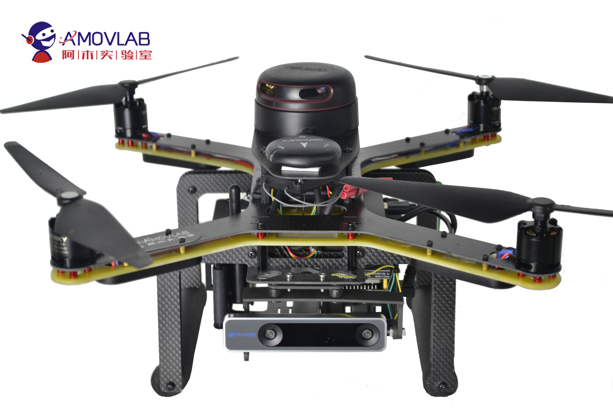
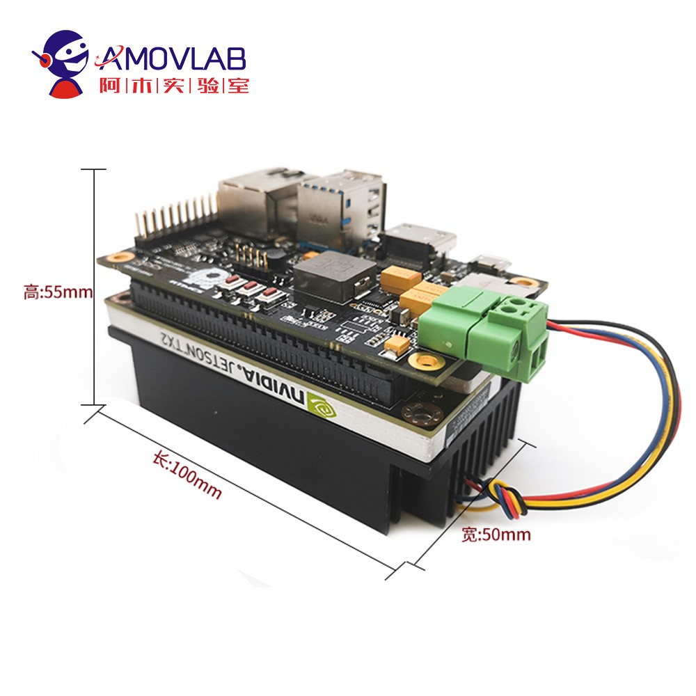
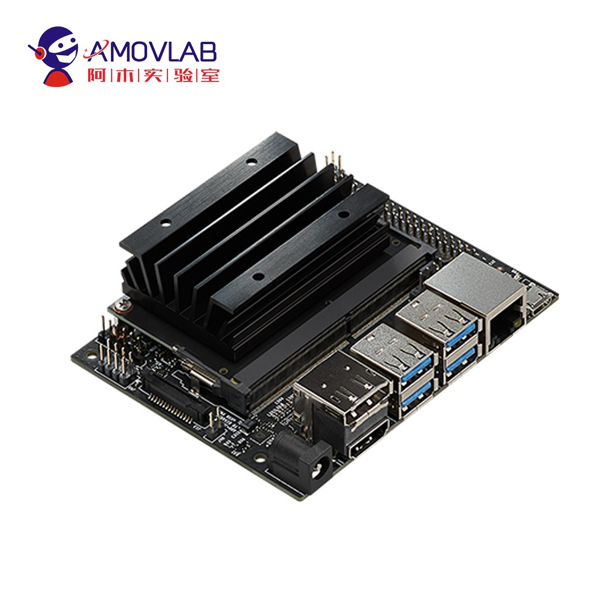

.. 项目介绍:

================
项目介绍
================

**Prometheus200(简称P200)** 是一款专为科研工作者及无人机开发者设计的无人机开发实验平台,适用于无人机专业应用研究和开发.
本开发平台提供丰富的demo例程,涵盖路径规划,导航滤波,建模控制,目标识别,深度学习,视觉/激光SLAM,编队控制等多个无人机及机器视觉相关研究方向,为无人机科研开发助力.

P200是科研无人机开发平台,它由流行的开源组件以及与之配合使用的必要文档和库组成.

该套件包括有PX4组件包的飞控pixhawk硬件平台,作为板载计算机的NVIDIA TX2/Nano,用于视觉导航的相机,以及一系列其他的外部传感器.

更多tx2的性能信息请移步 `淘宝tx2 <https://item.taobao.com/item.htm?spm=a230r.1.14.142.740d3d8dESdsgz&id=606200196150&ns=1&abbucket=13#detail>`__

更多Nano的性能信息请移步 `淘宝Nano <https://item.taobao.com/item.htm?spm=a230r.1.14.37.740d3d8dESdsgz&id=604117310426&ns=1&abbucket=13#detail>`__

P200科研无人机平台包含了基于NVIDIA TX2/Nano板载计算机对飞控的mavros逻辑控制程序,改程序的源代码是开放的,可以在 `Github <https://github.com/amov-lab/px4_command>`__ 上获得,
如果有疑惑,有问题的欢迎提 **issue** .

如果在文档教程中没有解决你想要的答案,加入我们研发者维护的平台,我们开发者很乐意为您解答: `amov社区论坛! <http://bbs.amovauto.com/>`__

