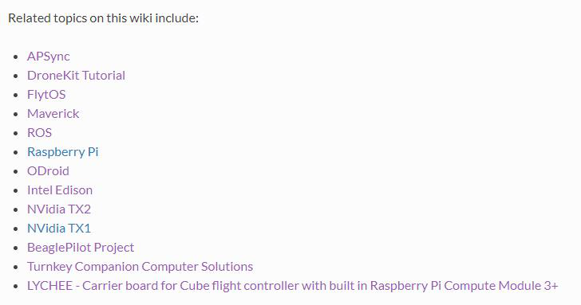
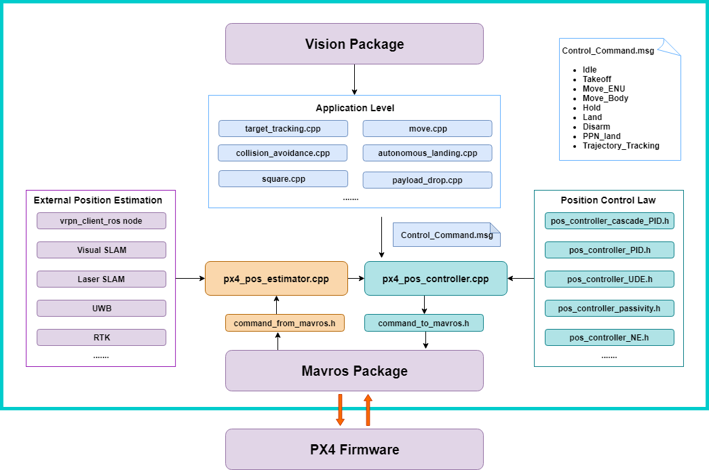
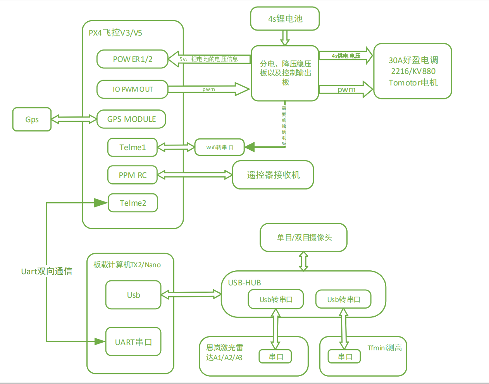
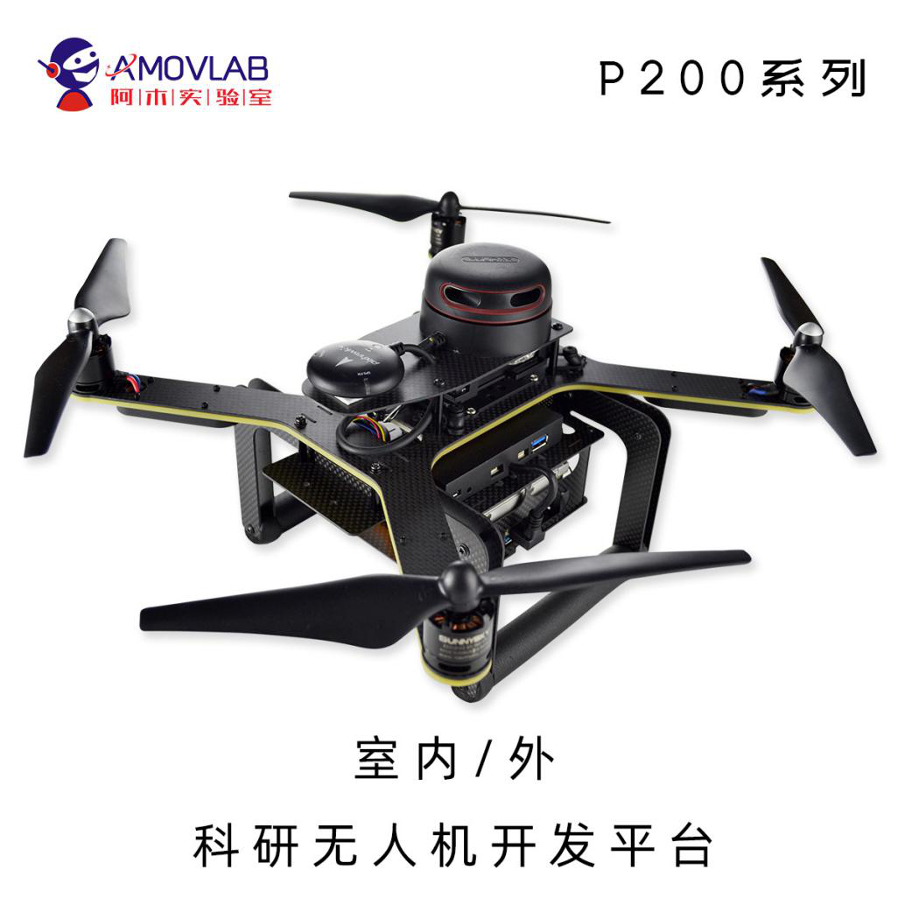
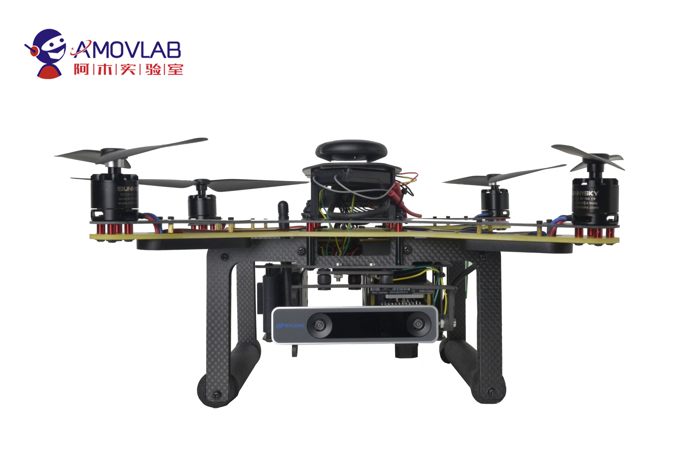
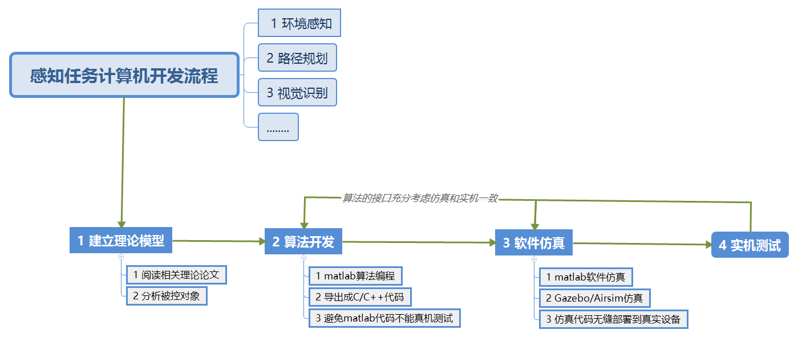

.. 无人系统板载(任务)计算机:

=========================
无人系统板载(任务)计算机
=========================

小型无人机系统的计算机系统 
===========================

相对比较完善的小型无人机计算机系统，包含飞控计算机(相当于人的脑干，负责完成运动控制系统的平衡性)，感知和任务管理计算机(相当于人体的大脑，负责处理来自任务载荷的数据，并且做出决策，发送控制指令给飞控计算机)，
任务载荷模块(相当于人体的眼睛等传感器，感知周围环境数据然后给任务管理计算机处理)。电气系统是最底层的执行机构。地面站是人机交互系统。数据链接由无线数据传输系统来完成。
各个模块都有对应的软件和硬件设备，相对独立，互相协作，构成一个完整的无人机计算机系统。

飞控计算机由单片机(MCU)和对应的实时操作系统担任，要求就是实时性强，任务执行频率上百赫兹，可以快速的控制电器系统，强调响应的实时性和相对简单可靠，确保被控对象的平衡稳定。

感知和任务管理计算机由PowerPC，DSP，Arm，X86构架的CPU来担任，通常都是计算性能强大，并且运行之上的操作系统可靠如(VxWorks)等。负责运算和决策，通常这种任务计算复杂，某些情况下也要求较高的任务执行频率。

.. image:: images/wiki_homepage/Perception_and_task_computer.png

PX4/Ardupilot的计算机系统
=============================

除了Ardupilot和PX4的飞控计算机之外，他们也有任务计算机系统，但是相对还不是很完善，比如目前的飞控计算机中还做一部分的任务管理计算机的工作，比如航线规划，避障，环境感知等，没有做到模块分离和独立。

Ardupilot支持的Companion Computers(任务计算机)，大多以Linux/ROS/Mavros为软件构架，硬件上以Arm内核,X86内核为主。下面是 `Ardupilot官方 <http://ardupilot.org/dev/docs/companion-computers.html>`__ 给出的列表：

从功能上，有的是提供一个软件的框架，可以适配很多的不同硬件设备，有的提供一个完整的软件硬件解决方案提供4G通信，图像处理等高级功能。
也在向模块独立的方向上发展。相信随着技术的发展，这些板载计算机(任务计算机)将会越来越完善，越来越像成熟的软件硬件方向发展(可以参考大型载人航空器的设计)。
随着应用广泛和技术也会出现诸如PowerPC和VxWorks为代表的任务管理计算机系统，和飞控计算机系统彻底软件硬件分离。

阿木实验室的感知任务管理系统
==============================

我们也计划在任务管理系统上做一些工作，我们开源了我们的板载计算机软件框架(Px4Commander暂时命名)

px4_command功能包是一个基于Ardupilot/PX4开源固件及Mavros功能包的开源项目,提供一个感知和任务计算机模块。
目前已集成无人机外环控制器修改、目标追踪、激光SLAM定位、双目V-SLAM定位、激光避障等上层开发代码、后续将陆续推 出涵盖任务决策、路径规划、滤波导航、单/多机控制等无人机/无人车/无人船科研及开发领域的功能。 
配合板载计算机(树莓派、TX2、Nano)等运算能力比较强的处理器，来实现复杂算法的运行，运行得到的控制指令通过串口或者网口通信发送给底层控制板。

感知和任务管理计算机的开发
-----------------------------

在Ardpuliot/PX4的感知和任务管理计算机开发中，和大型无人机的任务管理计算机开发不同，小型无人机的任务管理计算机集中在环境感知，
自动避障路径规划，目标物体识别追踪，自动搜寻，集群控制策略等领域。符合小型化，低空域，在有限空间飞行的特点。

**开发重点**
^^^^^^^^^^^^^^^

**环境感知:** 以激光雷达，视觉传感器等硬件为主的激光SLAM/视觉SLAM开发方向，获得设备自身的方位，速度和姿态。

**路径规划:** 以自动避障的路径规划，以集群控制为主的路径规划，以自动搜寻的路径规划，以无人机自动调度系统的路径规划。获得当前空间和时间下的设备自身的最优运动路径。

**视觉识别:** 以目标物体的识别，感知，追踪，引导。获得目标物体的相对位置。

**开发手段**
^^^^^^^^^^^^^^^^

按照完整的开发流程:

-   1 建立数学模型
-   2 算法开发
-   3 仿真
-   4 实机测试

以完成一个 **激光雷达避障** 为例：

**1 数学建模**

业界关于避障的算法，有很多论文，开源的代码。比如可以采用简单高效的VFH算法，数学模型相对比较简单，方便构建。

**2 算法开发**

根据数学模型编写代码，涉及复杂的数学公式可以采用matlab来开发，VFH比较简单，开源的代码做一下优化就可以完成。

**3 仿真**

避障属于场景和逻辑，最好用三维可视环境搭建出虚拟环境，在虚拟环境中仿真，常用的仿真工具有FlightGear，Gazebo，AirSim等等，写好的算法在虚拟仿真环境中运行，看一看避障的效果如何。总结就是仿真有问题，实际测试一定有问题。

**4 实机测试**

仿真测试通过以后，然后实机测试具体功能，在仿真中传感器数据大多为理想值，仿真的代码有时候不能完全适用于真实环境。当然可以在仿真系统中加入噪声数据，和建立仿真模型的时候高度还原真实物理场景，这样也可以提高仿真代码的适应性。

我们在感知任务管理计算机设计的时候，就充分考虑到一个完整的开发流程，来提高开发效率。

尤其是一些复杂的算法开发，Matlab接口，三维任务仿真接口必不可少，可以极大的提升开发效率。我们提供的这个任务计算机功能包是基于ROS/Mavros开发，三维仿真接口比较完善比如用Gazebo/Airsim。Matlab的接口在基于集群的路径规划非常有用。

..
 ..image:: images/P200-LOGO.jpg

..
 **Prometheus200(简称P200)** 是一款专为科研工作者及无人机开发者设计的无人机开发实验平台,适用于无人机专业应用研究和开发.
 本开发平台提供丰富的demo例程,涵盖路径规划,导航滤波,建模控制,目标识别,深度学习,视觉/激光SLAM,编队控制等多个无人机及机器视觉相关研究方向,为无人机科研开发助力.
 P200是科研无人机开发平台,它由流行的开源组件以及与之配合使用的必要文档和库组成.
 该套件包括有PX4组件包的飞控pixhawk硬件平台,作为板载计算机的NVIDIA TX2,用于视觉导航的相机,以及一系列其他的外部传感器.
 P200科研无人机平台包含了基于NVIDIA TX2板载计算机对飞控的mavros逻辑控制程序,改程序的源代码是开放的,可以在 `Github <https://github.com/amov-lab/px4_command>`__ 上获得,
 如果有疑惑,有问题的欢迎提 **issue** .
 如果在文档教程中没有解决你想要的答案,加入我们研发者维护的平台,我们开发者很乐意为您解答: `amov社区论坛! <http://bbs.amovauto.com/>`__

.. toctree::
    :hidden:

    项目介绍 <docs/项目介绍>
    新手入门 <docs/新手入门>
    手动飞行 <docs/手动飞行>
    自主飞行之入门 <docs/自主飞行之入门>
    自主飞行之进阶 <docs/自主飞行之进阶>
    自主飞行之二次开发 <docs/自主飞行之二次开发>
    Gazebo仿真 <docs/Gazebo仿真>
    AirSim仿真 <docs/AirSim仿真>
    可选配件 <docs/可选配件>

